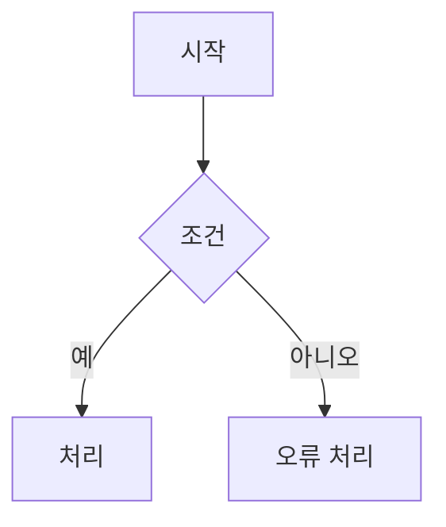

# 3. Architecture

실제로 구현될 형상이 어떤 아키텍처를 따르는지 정의하라. 영역마다 가능한 대안을 비교해 가장 합리적인 것을 고르고, 선택 근거를 산출물에 적어라. 이 단계에서는 코드를 수정하지 않는다.

공통 규칙은 `sdd-workflow` 스킬을 따른다.

## 입력

- `$TASK_DIR/explore/EXPLORE.md`
- `$TASK_DIR/plan/PLAN.md`, `ACCEPTANCE_CRITERIA.md`

## 절차

1. `$TASK_DIR/architecture/`를 만들고 타임라인을 기록하라.
   ```bash
   node .claude/skills/sdd-workflow/scripts/timeline.mjs mark "$TASK_DIR" architecture - start
   ```
2. 입력 문서를 읽고, 이번 작업에서 아키텍처 결정이 필요한 영역을 뽑아라. 예: 모듈 구조와 계층, 의존 방향, 서비스 간 통신, 동시성·격리 모델, 오류 처리·재시도, 설정 주입, 배포 형태, 데이터 모델·저장소·마이그레이션.
3. 영역마다 현실적인 대안을 2개 이상 떠올려 장단점을 비교하고 하나를 선택하라. 판단 기준은 인수 조건 충족, 기존 코드와의 일관성, `CLAUDE.md` 제약(예: Host OS·Docker 두 배포 경로 지원), 단순성, 변경 비용이다. 기존 구조를 유지하는 것이 최선이면 그것을 선택하고 이유를 적어라.
4. 아래 템플릿으로 세 문서를 작성하라.
   - `SOFTWARE_ARCHITECTURE.md`: 전체 아키텍처와 근거, 개별 애플리케이션 서비스의 내부 구조. 애플리케이션 서비스가 둘 이상이면(예: 앱 데몬, Paseo, PostgreSQL, GitHub API) 서비스 간 통신 인터페이스(프로토콜, 메시지·API 형태, 오류 처리)를 정의하라.
   - `DATA_ARCHITECTURE.md`: 데이터 모델(엔티티, 필드, 관계), 저장소, 데이터 수명주기, 마이그레이션, 정합성·동시성 규칙. 이번 작업이 데이터를 건드리지 않으면 관련 데이터 구조의 현재 상태와 "변경 없음"을 적어라.
   - `FLOW_CHART.md`: 구현할 기능의 동작 흐름을 mermaid로 그려라. 정상 흐름과 주요 분기·오류 흐름을 포함하라. 필요하면 `sequenceDiagram`, `erDiagram`, `stateDiagram-v2`를 함께 쓴다.
5. mermaid 문법을 점검하라. 노드 라벨에 괄호·따옴표·특수문자가 있으면 `A["라벨 (예)"]`처럼 따옴표로 감싸라.
6. 타임라인을 기록하라.
   ```bash
   node .claude/skills/sdd-workflow/scripts/timeline.mjs mark "$TASK_DIR" architecture - end
   ```
7. 사용자에게 산출물 경로와 영역별 주요 결정을 한 줄씩 보고하라.

## 구현 중 아키텍처 수정

Implementation 단계에서 아키텍처를 바꿔야 할 때 이 스킬의 문서를 수정한다.

- 해당 문서의 본문을 새 결정에 맞게 고치고, 문서 끝 "변경 이력"에 날짜, iteration, 바뀐 내용, 이유를 추가하라.
- `ACCEPTANCE_CRITERIA.md`는 어떤 경우에도 수정하지 않는다. 아키텍처 변경이 인수 조건을 충족할 수 없게 만든다면 변경하지 말고 사용자에게 알려라.

## SOFTWARE_ARCHITECTURE.md 템플릿

```markdown
# SOFTWARE ARCHITECTURE — <작업 제목>

- 작성: <YYYY-MM-DD HH:MM>

## 1. 개요
<이번 작업 후 시스템이 어떤 구조로 동작하는지 요약, 기존 대비 달라지는 점>

## 2. 아키텍처 결정
### 2.1 <결정 영역>
| 대안 | 장점 | 단점 |
|---|---|---|
| A. ... | ... | ... |
| B. ... | ... | ... |
- **선택**: A
- **근거**: <인수 조건, 기존 코드, CLAUDE.md 제약과 연결해 설명>

## 3. 서비스 구성
| 서비스 | 역할 | 실행 형태 (Host / Docker) |
|---|---|---|

## 4. 서비스 내부 구조
### <서비스 이름>
<계층·모듈 구성, 의존 방향, 주요 컴포넌트와 책임>

## 5. 서비스 간 인터페이스
| 호출자 → 대상 | 프로토콜 | 인터페이스 | 오류 처리 |
|---|---|---|---|

## 변경 이력
| 일시 | Iteration | 변경 내용 | 이유 |
|---|---|---|---|
```

## DATA_ARCHITECTURE.md 템플릿

````markdown
# DATA ARCHITECTURE — <작업 제목>

- 작성: <YYYY-MM-DD HH:MM>

## 1. 개요
<데이터 저장소와 이번 작업의 데이터 변경 요약>

## 2. 데이터 모델
```mermaid
erDiagram
    ...
```
| 엔티티 | 필드 | 타입 | 제약 | 설명 |
|---|---|---|---|---|

## 3. 데이터 수명주기
<생성·갱신·조회·삭제 시점과 주체>

## 4. 마이그레이션
<스키마 변경 방법, 기존 데이터 처리, 롤백>

## 5. 정합성과 동시성
<트랜잭션 경계, 중복 처리 방지, 동시 접근 규칙>

## 6. 결정과 근거
<저장 방식·모델링 선택의 대안 비교와 근거>

## 변경 이력
| 일시 | Iteration | 변경 내용 | 이유 |
|---|---|---|---|
````

## FLOW_CHART.md 템플릿

````markdown
# FLOW CHART — <작업 제목>

- 작성: <YYYY-MM-DD HH:MM>

## <기능 이름>
<흐름 설명 한두 문장>



## 변경 이력
| 일시 | Iteration | 변경 내용 | 이유 |
|---|---|---|---|
````

## 완료 조건

- 결정이 필요한 영역마다 대안 비교와 선택 근거가 있다.
- 서비스가 둘 이상이면 서비스 간 인터페이스가 정의되어 있다.
- 구현할 기능의 흐름이 mermaid 플로우차트로 표현되어 있다.
- 결정 내용이 `CLAUDE.md` 제약과 인수 조건에 어긋나지 않는다.
