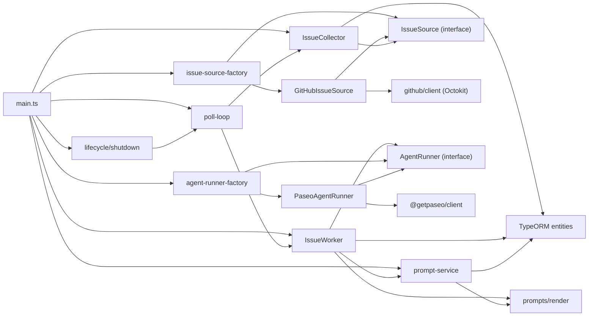

# 아키텍처

`reports/`의 SDD 산출물(02.architecture)에서 뽑아 현재 코드(`app/src`) 기준으로 정리한 설계 문서다.
운영·실행 방법은 [README](../README.md)를, 결정의 대안 비교와 근거는 [decisions.md](decisions.md)를 본다.

## 1. 시스템 구성

| 구성요소 | 역할 | Host 실행 | Docker 실행 |
| --- | --- | --- | --- |
| 앱 데몬 (`app/`) | 이슈 폴링·큐 적재, 프롬프트 선택·렌더링, 에이전트 실행 오케스트레이션 | `node --env-file=../.env dist/main.js` | `app` 컨테이너 |
| Paseo 데몬 | worktree(workspace) 생성, 에이전트 세션 관리, provider CLI 실행 | `paseo daemon start` | `paseo` 컨테이너 (`PASEO_IMAGE`) |
| PostgreSQL | `issue`, `prompt_version` 저장 | 로컬/원격 인스턴스 | `postgres` 컨테이너 |
| GitHub API | 이슈 원본 | 외부 | 외부 |
| provider CLI (Claude Code / Codex) | 실제 작업 수행 | Paseo 데몬이 실행 | Paseo 컨테이너 안에서 실행 |

앱은 provider CLI를 직접 부르지 않는다. 앱 → Paseo 데몬은 WebSocket(`ws`/`wss`, `/ws`), 앱 → PostgreSQL은 TypeORM(pg), 앱 → GitHub은 Octokit(HTTPS)이다.

**배포 중립 원칙**: 앱 코드에 `DEPLOYMENT` 분기는 없다. Host와 Docker는 같은 코드 경로를 타고, 차이는 환경변수 값(특히 `PROJECT_PATH`, `PASEO_HOST`, `DB_HOST`)뿐이다. Docker Compose는 `env_file: .env`로 값을 넘기고 컨테이너 네트워크 기준 값(`PASEO_HOST`, `DB_HOST`, `DEPLOYMENT` 등)만 덮어쓰므로, 환경변수를 늘려도 compose 파일을 고칠 일이 없다.

## 2. 앱 데몬 모듈 구조

```
app/src
├── main.ts                      합성 루트. 구현체를 조립하는 유일한 곳
├── config/env.ts                zod 환경변수 스키마 + resolveProvider/resolvePermissionMode/resolvePaseoUrl
├── logger.ts                    pino 로거 (환경변수 검증보다 먼저 만들어져야 해 process.env를 직접 읽는다)
├── lifecycle/shutdown.ts        createShutdown — 신호 종료(exit 0) / 치명 오류 종료(exit 1)
├── scheduler/poll-loop.ts       startPollingLoop — 자기 재예약 인터벌 루프
├── issues/
│   ├── types.ts                 SourceIssue (소스 중립 정규화 타입)
│   ├── issue-source.ts          IssueSource 인터페이스
│   ├── issue-source-factory.ts  createIssueSource — 이슈 소스 확장 지점
│   ├── issue-collector.ts       IssueCollector — 중복 필터 + 큐 적재
│   └── sources/github-issue-source.ts
├── github/client.ts             Octokit 생성(throttle/retry). GitHub 소스만 의존한다
├── prompts/
│   ├── render.ts                자리표시자 추출·검사·치환 (의존성 없음)
│   └── prompt-service.ts        getLatestPrompt + UnusablePromptError 계층
├── paseo/
│   ├── client.ts                connectPaseo
│   ├── agent-runner.ts          AgentRunner 인터페이스, AgentRunOutcome, AgentRunError
│   ├── paseo-agent-runner.ts    Paseo 구현체
│   └── agent-runner-factory.ts  createAgentRunner — 에이전트 러너 확장 지점
├── worker/issue-worker.ts       큐 소비, 프롬프트 렌더링, 러너 호출, 결과 기록
└── db/                          DataSource + EntitySchema (issue, prompt_version)
```

### 의존 방향



지켜야 하는 성질은 네 가지다.

- `IssueCollector`와 `poll-loop`에 GitHub·Octokit import이 없다. 소스는 인터페이스로만 들어온다.
- `IssueWorker`는 `AgentRunner` 인터페이스에만 의존하고 `@getpaseo/client`를 런타임 import하지 않는다. 덕분에 스텁 러너로 워커를 돌릴 수 있다.
- 구현체를 아는 프로덕션 파일은 팩토리 두 개(`issue-source-factory.ts`, `agent-runner-factory.ts`)뿐이고, `main.ts`는 팩토리만 부른다.
- `prompts/render.ts`는 아무것에도 의존하지 않는다. DB·Paseo를 모른다.

### 컴포넌트 책임

| 컴포넌트 | 하는 일 | 하지 않는 일 |
| --- | --- | --- |
| `poll-loop` | 기동 즉시 1회 + 사이클 종료 후 재예약, 사이클 오류 격리, 주기 초과 경고, `stop()` | 이슈 해석, DB 접근 |
| `IssueSource` 구현체 | 외부 소스 조회·정규화(`SourceIssue[]`), 증분 조회 상태 관리 | 중복 판정, DB 접근, 스케줄링 |
| `IssueCollector` | 기존 행 필터, `INSERT ... ON CONFLICT DO NOTHING` 적재, 적재 후 `commitFetched?()` 호출 | provider 응답 해석 |
| `IssueWorker` | `pending` 이슈 선점, 최신 프롬프트 조회·렌더링, 러너 호출, 결과를 같은 행에 기록 | workspace·에이전트 세부, 프로세스 종료 |
| `AgentRunner` 구현체 | workspace 확보(재사용/생성), 에이전트 생성·프롬프트 전달, 완료 대기·취소, 권한 거부, 세션 아카이브 | DB 접근, 재시도 정책 |
| `prompt-service` | 최신 프롬프트 조회와 사용 가능 여부 판정 | 프롬프트 생성·시딩(데몬은 `prompt_version`에 쓰지 않는다) |
| `shutdown` | abort → 루프 정지 → Paseo·DB 닫기 → `process.exit` | 오류 판정 |

## 3. 되풀이되는 설계 패턴: 인터페이스 + 구현체 + 팩토리

교체 가능한 외부 경계는 모두 같은 모양이다.

| 경계 | 인터페이스 | 현재 구현체 | 팩토리 | 선택 환경변수 |
| --- | --- | --- | --- | --- |
| 이슈 소스 | `IssueSource` | `GitHubIssueSource` | `createIssueSource(env)` | `ISSUE_SOURCE` |
| 에이전트 실행 | `AgentRunner` | `PaseoAgentRunner` | `createAgentRunner(env, client)` | (없음. `WORKER_AGENT`는 provider 선택) |

팩토리는 `satisfies Record<Env["ISSUE_SOURCE"], …>`로 환경변수 enum의 모든 값을 덮도록 강제한다. enum에 값만 늘리고 구현체를 빠뜨리면 컴파일이 깨진다.

### 새 이슈 소스를 추가하려면

1. `app/src/<provider>/client.ts` — 전송 계층(필요하면).
2. `app/src/issues/sources/<provider>-issue-source.ts` — `IssueSource` 구현. 조회와 `SourceIssue` 정규화까지만 한다.
3. `app/src/config/env.ts`의 `ISSUE_SOURCE` enum에 값 추가.
4. `app/src/issues/issue-source-factory.ts`의 `factories`에 한 줄 추가.

중복 필터와 큐 적재는 `IssueCollector`가 소스와 무관하게 처리하므로 다시 구현하지 않는다. 다만 **여러 소스를 동시에 운용하려면 자연키 `(repository, issueId)`에 소스 구분이 필요하다**([known-issues.md](known-issues.md) 참고).

### 새 에이전트 러너를 추가하려면

`AgentRunner`를 구현하고 `createAgentRunner`에서 고른다. 워커는 `AgentRunOutcome`의 5개 상태(`success`/`error`/`permission`/`timeout`/`cancelled`)만 보므로 워커 수정은 필요 없다.

## 4. 오류 모델

세 층이 각각 다른 규칙을 쓴다.

| 층 | 규칙 | 결과 |
| --- | --- | --- |
| 폴링 사이클 (`poll-loop`) | 사이클 전체를 try/catch. 로그만 남기고 다음 주기 계속 | 데몬은 죽지 않는다 |
| 에이전트 실행 (`PaseoAgentRunner`) | **모듈 단계 실패는 예외**(`AgentRunError`, 메시지 앞에 `[workspace]`/`[agent]`/`[wait]`), **에이전트 자체의 실패는 결과 객체**(`status: "error"`) | 운영자가 로그·`issue.error`에서 실패 단계를 구분할 수 있다 |
| 프롬프트 (`prompt-service`) | 쓸 수 없는 프롬프트는 `UnusablePromptError`(하위: `PromptHistoryEmptyError`, `MissingRequiredPlaceholderError`) | 기동 시엔 기동 실패, 운영 중엔 이슈 되돌림 + 데몬 종료(exit 1) |

설정 오류는 폴링이 시작되기 전에 드러난다. `config/env.ts`의 zod 스키마가 실패하면 항목명을 담은 메시지와 함께 종료 코드 1로 끝난다.

## 5. 종료 정책

`lifecycle/shutdown.ts`의 `createShutdown`이 유일한 종료 경로다. 여러 번 불려도 처음 한 번만 수행한다.

```
abortController.abort()  →  loop.stop()  →  paseo.close()  →  dataSource.destroy()  →  process.exit(code)
```

- **abort가 먼저**인 것이 중요하다. `loop.stop()`은 진행 중인 사이클이 끝나기를 기다리는데, 사이클 안에는 최대 `AGENT_TIMEOUT_MS`짜리 에이전트 대기가 들어 있다. 먼저 abort해 그 대기를 끊어야 종료가 지연되지 않는다.
- `onSignal(SIGTERM/SIGINT)` → exit 0, `onFatal(error)` → fatal 로그 후 exit 1.
- 워커는 프로세스 종료를 모른다. `onFatal` 콜백만 받아 호출하고, 종료는 `main.ts`가 연결한다. 콜백은 루프 사이클 안에서 불리므로 **종료 완료를 기다리지 않는다**(기다리면 교착된다).
- 취소된 이슈는 `pending`으로 돌아간다. 에이전트는 Paseo 안에서 계속 돌 수 있고, 다음 기동에서 같은 브랜치의 workspace를 재사용해 이어간다.

## 6. 관측

pino 로거를 쓰고, 러너는 `logger.child({ component: "agent-runner", issue, branch })`로 이슈별 컨텍스트를 붙인다.

| 레벨 | 남기는 사건 |
| --- | --- |
| `info` | 기동 요약, 폴링 루프 시작, 이슈 큐 추가, 대기 이슈 처리 시작, workspace 생성/재사용, provider 기본 모델 선택, 에이전트 생성, 에이전트 실행 종료(상태·토큰 사용량), 이슈 처리 완료, 종료 |
| `warn` | 사이클이 주기를 초과해 건너뜀, 알 수 없는 자리표시자, 권한 요청 거부, 아카이브 실패, `branch-off` 실패 후 checkout 폴백, 종료 신호로 취소, GitHub rate limit |
| `error` | 루프 사이클 실패, 이슈 처리 실패, Paseo·DB 닫기 실패 |
| `fatal` | 기동 실패, 더 진행할 수 없는 오류로 종료 |
| `debug` | 폴링 완료(`fetched`/`enqueued`), 에이전트 상태 변화 |

토큰 사용량(`lastUsage`)은 로그에만 남고 DB에 저장하지 않는다.
