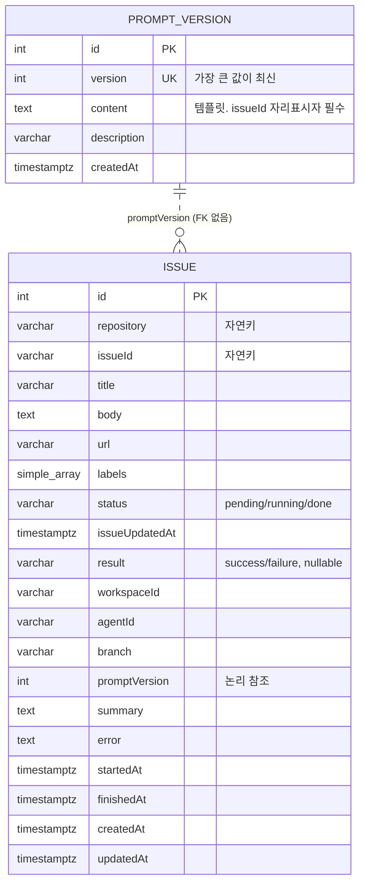

# 데이터 모델

PostgreSQL 한 곳만 쓰고 접근은 TypeORM(`EntitySchema`)으로만 한다. 테이블은 `issue`와 `prompt_version` 두 개다.
운영 중 상태를 조회하는 SQL은 [README의 "이슈 처리 상태 확인"](../README.md#이슈-처리-상태-확인)에 있다.

> `reports/`의 초기 산출물은 `pending_issue`/`processed_issue` 두 테이블과 `attempts`/`lastError` 컬럼을 전제한다.
> 지금 스키마는 단일 `issue` 테이블이다([history.md](history.md) 참고).

## 1. ER

`issue.promptVersion`에 FK를 걸지 않는다. 운영자가 옛 버전 행을 지워도 처리 이력 기록이 막히지 않아야 하기 때문이다.

## 2. 테이블

### `issue` — 큐이자 처리 이력

처리가 끝나도 행을 지우지 않고 같은 자리에 결과를 덮어쓴다. 그래서 이 테이블 하나가 **대기 큐**와 **중복 방지 이력**을 겸한다.

| 컬럼 | 타입 | 제약 | 설명 |
| --- | --- | --- | --- |
| `repository`, `issueId` | varchar(255), varchar(128) | `UQ_issue_repo_issue_id` 유니크 | 자연키. `issueId`는 소스마다 형식이 달라 문자열이다(GitHub은 이슈 번호) |
| `status` | varchar(16) | 기본 `pending`, `IDX_issue_status` | `pending` → `running` → `done` |
| `result` | varchar(16) | nullable | `done`일 때 `success`/`failure` |
| `title`, `body`, `url`, `labels`, `issueUpdatedAt` | — | — | 수집 시 소스에서 정규화해 넣는다 |
| `workspaceId`, `agentId`, `branch` | varchar, nullable | — | Paseo 실행 결과. 취소로 끝나면 기록하지 않는다 |
| `promptVersion` | int, nullable | — | 그 실행에 쓴 프롬프트 버전 |
| `summary`, `error` | text, nullable | — | 에이전트 마지막 메시지 / 실패 사유 |
| `startedAt`, `finishedAt` | timestamptz, nullable | — | 선점 시각 / 완료 시각 |

재시도 개념이 없다. 실패한 이슈도 다시 시도하지 않고 `done`/`failure`로 남으며, 다시 처리하려면 운영자가 `status`를 `pending`으로 되돌린다.

### `prompt_version` — 프롬프트 이력

| 컬럼 | 타입 | 제약 | 설명 |
| --- | --- | --- | --- |
| `version` | int | unique | 가장 큰 값이 최신. 같은 값은 DB가 거부한다 |
| `content` | text | not null | 템플릿. `{{issueId}}` 포함 여부는 앱이 검사한다(DB 제약 아님) |
| `description` | varchar(512) | nullable | 운영자 메모 |

**데몬은 이 테이블에 쓰지 않는다.** 등록은 운영자만 한다([README의 "프롬프트 변경"](../README.md#프롬프트-변경)).

## 3. 데이터 수명주기

| 단계 | 주체 | 동작 |
| --- | --- | --- |
| 조회 | `IssueSource` | 외부 소스를 읽어 `SourceIssue[]`로 정규화. DB 접근 없음. 증분 워터마크는 아직 전진시키지 않는다 |
| 중복 판정 | `IssueCollector` | `(repository, issueId)`로 `existsBy` — 대기 중이든 끝났든 행이 있으면 건너뛴다 |
| 적재 | `IssueCollector` | `INSERT ... ON CONFLICT DO NOTHING`. 삽입된 행만 `enqueued`로 센다. `status='pending'` |
| 워터마크 확정 | `IssueCollector` → `IssueSource` | 배치 적재가 모두 끝난 뒤에만 `commitFetched?()`. 적재 중 예외가 나면 호출되지 않아 다음 사이클에 다시 조회된다 |
| 선점 | `IssueWorker` | `UPDATE issue SET status='running', startedAt=now WHERE id=? AND status='pending'` — `affected=1`인 쪽만 처리한다 |
| 완료 | `IssueWorker` | 같은 행에 `status='done'`, `result`, `workspaceId`/`agentId`/`branch`, `promptVersion`, `summary`, `error`, `finishedAt` 기록 |
| 취소 | `IssueWorker` | 종료 신호로 끊겼으면 `status='pending'`으로만 되돌린다(이력 아님) |
| 치명 오류 | `IssueWorker` | 프롬프트를 쓸 수 없으면 `status='pending'`으로 되돌리고 종료를 요청한다 |

### 증분 조회 워터마크

`GitHubIssueSource`는 `updated_at` 기준 `since` 워터마크를 **프로세스 메모리에만** 둔다.

- 재기동 후 첫 사이클은 전체 open 이슈를 읽지만, 중복 필터가 걸러 `enqueued=0`이 된다.
- 워터마크를 조회 직후가 아니라 적재 성공 후(`commitFetched()`)에 전진시킨다. 조회 직후에 전진시키면, 적재가 DB 오류로 실패한 사이클의 이슈가 다음 조회에서 `since`에 걸려 빠지고(루프는 오류를 삼킨다) 그 이슈가 다시 갱신되기 전까지 영영 큐에 들어가지 못한다.

## 4. 정합성과 동시성

- **중복 방지 2중화**: `existsBy` 선조회가 대부분을 거르고, `(repository, issueId)` 유니크 제약 + `ON CONFLICT DO NOTHING`이 경쟁 상태의 최종 방어선이다.
- **트랜잭션 경계**: 이슈 1건 적재가 단일 INSERT 한 문장이다. 배치를 한 트랜잭션으로 묶지 않는다 — 중간에 실패해 일부만 적재돼도 다음 사이클이 나머지를 채운다(멱등).
- **사이클 겹침 없음**: 스케줄러가 사이클 종료 후에만 다음 사이클을 예약하므로 한 프로세스 안에서 수집기가 동시에 두 번 돌지 않는다. 이슈는 순차 처리한다.
- **다중 인스턴스**: 앱을 여러 개 띄워도 유니크 제약과 조건부 선점 UPDATE(`status='pending'` 일치자만) 덕에 이슈 1건은 한 번만 처리된다.
- **프롬프트 읽기 일관성**: 이슈마다 최신 1행을 조회하고 캐시하지 않는다. 운영자 INSERT가 커밋된 뒤 시작된 처리부터 새 버전을 쓰므로 **재기동이 필요 없다**. 한 이슈 처리 안에서는 조회한 행 하나로 렌더링과 `promptVersion` 기록을 함께 해 서로 어긋나지 않는다.

## 5. 스키마 관리

마이그레이션 체계가 없다. `createDataSource`가 `synchronize: true`로 고정이라 **기동 시 엔티티 정의 기준으로 테이블을 자동 동기화**한다.

- 엔티티에서 컬럼을 빼면 기동 시 그 컬럼이 **삭제**된다. 운영 데이터가 있는 DB에서는 엔티티 변경 전에 백업을 생각해야 한다.
- 운영 환경에서 쓸 마이그레이션 체계 도입은 후속 과제다([known-issues.md](known-issues.md)).
