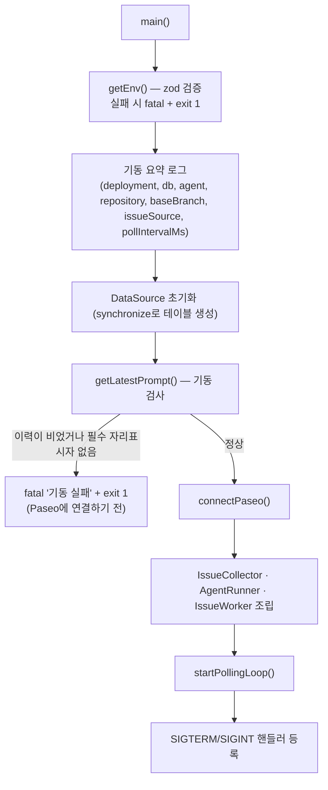
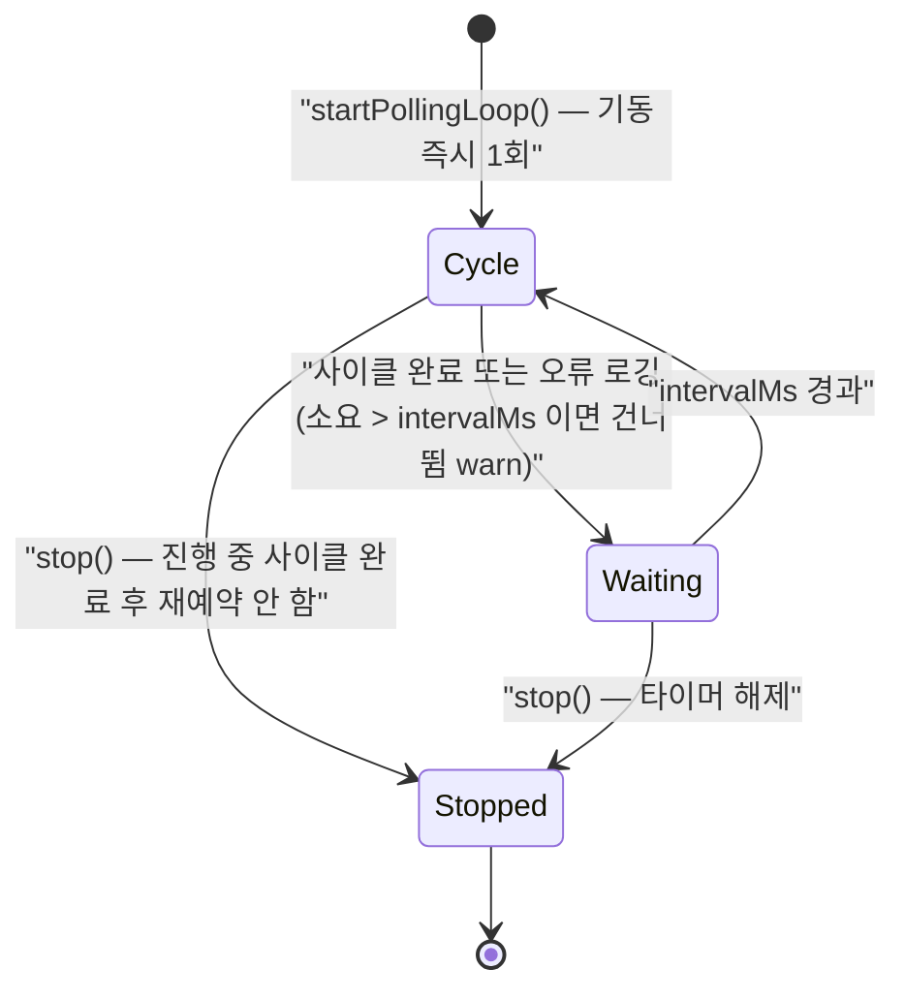
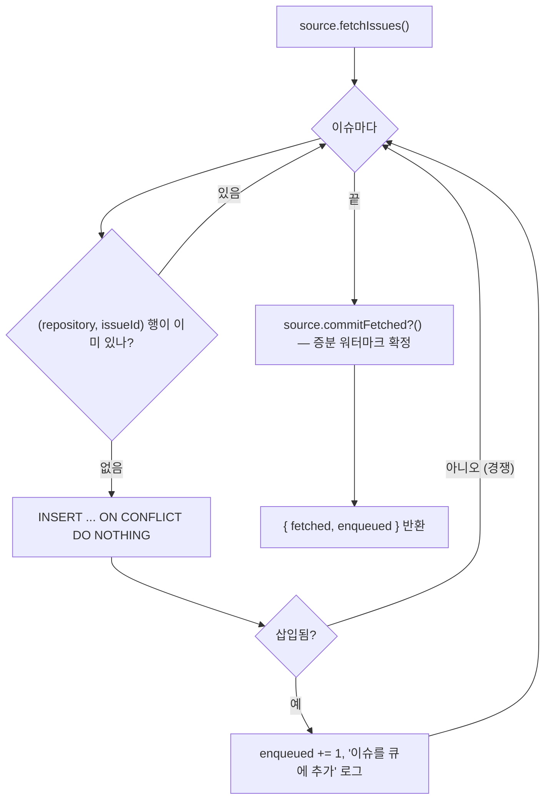
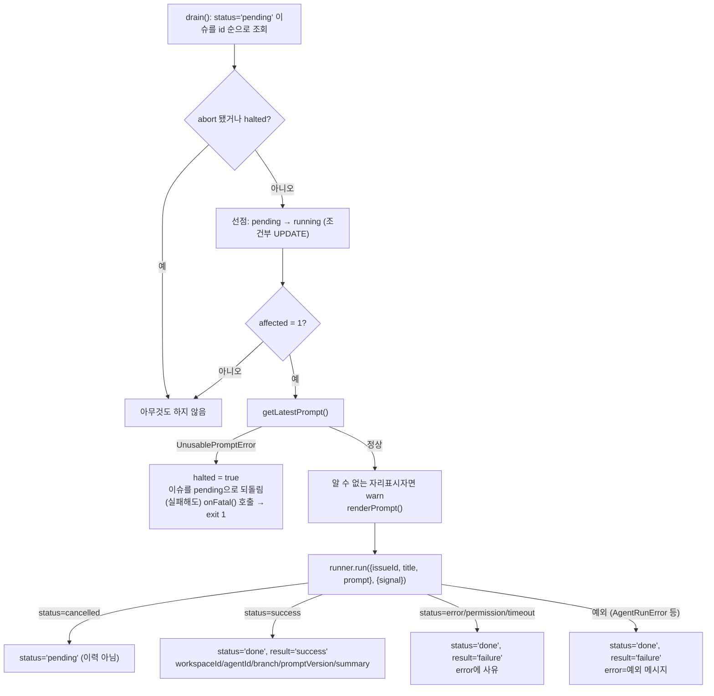
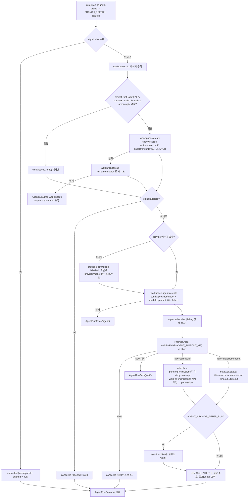

# 처리 흐름

현재 코드 기준 런타임 흐름이다. 모듈 구조는 [architecture.md](architecture.md), 저장 규칙은 [data-model.md](data-model.md)를 본다.

## 1. 기동



기동 검사를 Paseo 연결 **앞**에 두는 이유는, 쓸 수 없는 프롬프트로는 어차피 아무 이슈도 처리할 수 없는데 Paseo 세션을 먼저 열 이유가 없기 때문이다.

## 2. 폴링 루프



한 사이클은 `collector.collect()` → `worker.drain()`이고, 전체가 try/catch로 감싸져 있어 어떤 오류도 다음 주기를 막지 않는다. 주기는 "시작 간격"이 아니라 **"종료 → 시작 간격"**이다.

## 3. 수집 (`IssueCollector.collect`)



GitHub 소스는 조회 단계에서 `state=open`·`sort=created`·`per_page=100`으로 페이지네이션하고, `pull_request` 필드가 있는 항목(PR)을 버리고, `GITHUB_ISSUE_LABELS`가 있으면 라벨로 거른다.

## 4. 이슈 한 건 처리 (`IssueWorker.process`)



`issue.error`에 남는 사유는 `error`면 에이전트 오류 메시지, `permission`이면 `권한 요청으로 중단됨`, `timeout`이면 `AGENT_TIMEOUT_MS(…ms) 초과`다.

## 5. 에이전트 실행 (`PaseoAgentRunner.run`)



workspace는 실행 후에도 **남긴다**. 결과 확인과 PR 생성을 사람이 할 수 있어야 하고, 같은 이슈를 다시 처리할 때 이어서 작업하기 위해서다. 아카이브 대상은 에이전트 세션뿐이다.

## 6. 종료

```mermaid
sequenceDiagram
    participant OS
    participant main
    participant sd as createShutdown
    participant loop as PollingLoop
    participant worker as IssueWorker
    participant runner as PaseoAgentRunner
    participant paseo as Paseo 데몬

    OS->>main: SIGTERM / SIGINT
    main->>sd: onSignal(signal)
    sd->>sd: abortController.abort()
    Note over worker,runner: 진행 중 run()의 Promise.race가 abort로 먼저 끝난다
    runner-->>worker: outcome.status = cancelled
    worker->>worker: issue → pending
    sd->>loop: stop() (진행 중 사이클 완료 대기)
    sd->>paseo: client.close()
    Note over paseo: 에이전트는 데몬에서 계속 실행될 수 있다
    sd->>sd: dataSource.destroy()
    sd->>OS: exit 0
```

치명 오류 경로(`onFatal`)도 같은 절차를 타고 종료 코드만 1이다. 워커가 `onFatal`을 부를 때 종료 완료를 기다리지 않는 이유는, 그 호출이 루프 사이클 **안**에서 일어나기 때문이다 — 기다리면 `loop.stop()`이 그 사이클을, 사이클은 종료를 기다려 교착된다.
