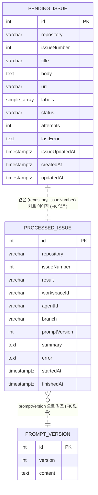

# DATA ARCHITECTURE — 지속적 Issue 수집 (Issue 소스 추상화 + Polling 주기 환경변수화)

- 작성: 2026-09-12 17:13

## 1. 개요

저장소는 PostgreSQL 하나이고 접근은 TypeORM(`EntitySchema` 기반)으로만 한다. **이번 작업은 DB 스키마를 바꾸지 않는다.** 기존 세 테이블(`pending_issue`, `processed_issue`, `prompt_version`)을 그대로 쓰며, 변경되는 것은 코드상 데이터 흐름의 소유권뿐이다.

- 추가되는 것: **메모리 상의 provider 중립 전송 타입 `SourceIssue`** (영속 엔티티가 아니다).
- 소유권 이동: `pending_issue` 적재 책임이 `IssuePoller`(삭제됨)에서 `IssueCollector`로 옮겨간다.
- 테이블·컬럼·인덱스·제약 변경: 없음. 따라서 마이그레이션도 없다.

## 2. 데이터 모델

두 이슈 테이블은 **FK 없이 `(repository, issueNumber)` 자연키로 논리적으로만 연결**된다. 한 이슈는 수명주기상 `pending_issue`에 있거나 `processed_issue`에 있거나이고, 둘 사이 이동이 삭제+삽입이라 FK가 오히려 방해가 된다.

### 이번 작업으로 새로 생기는 메모리 타입

| 타입 | 필드 | 타입 | 제약 | 설명 |
|---|---|---|---|---|
| `SourceIssue` | `repository` | `string` | 비어 있지 않음 | 소스 기준 저장소 식별자. GitHub은 `owner/repo` |
| | `issueNumber` | `number` | 양의 정수 | 소스 내 이슈 번호. `repository`와 합쳐 자연키 |
| | `title` | `string` | 512자 이내 (컬럼 길이) | 이슈 제목 |
| | `body` | `string \| null` | — | 이슈 본문 |
| | `url` | `string` | 512자 이내 | 사람이 여는 이슈 URL |
| | `labels` | `string[]` | 빈 배열 허용 | 라벨 이름 목록 |
| | `issueUpdatedAt` | `Date` | — | 소스 기준 최종 갱신 시각 |

`SourceIssue`는 `pending_issue` 컬럼의 부분집합과 정확히 대응한다(상태 컬럼 `status`/`attempts`/`lastError`는 수집 시점에 Collector가 초기값으로 채운다). 즉 **인터페이스가 약속하는 데이터 계약 = 큐 적재에 필요한 최소 필드**이며, provider 고유 필드(Octokit 응답의 나머지)는 경계를 넘지 않는다.

### 기존 엔티티 (변경 없음)

| 엔티티 | 필드 | 타입 | 제약 | 설명 |
|---|---|---|---|---|
| `PendingIssue` | `id` | int | PK, auto increment | |
| | `repository`, `issueNumber` | varchar(255), int | **UQ_pending_issue_repo_number** 유니크 | 중복 적재 최종 방어선 |
| | `status` | varchar(16) | `pending` \| `running` \| `failed`, 기본 `pending`, **IDX_pending_issue_status** | 워커 소비 상태 |
| | `attempts`, `lastError` | int, text | 기본 0 / nullable | 재시도 이력 |
| | `issueUpdatedAt` | timestamptz | — | 소스의 `updated_at` |
| `ProcessedIssue` | `repository`, `issueNumber` | varchar(255), int | **UQ_processed_issue_repo_number** 유니크 | 재처리 방지 이력 |
| | `result` | varchar(16) | `success` \| `failure` | |
| | `workspaceId`, `agentId`, `branch`, `promptVersion`, `summary`, `error` | — | nullable | Paseo 실행 결과 |
| `PromptVersion` | `version`, `content` | int, text | — | 최신 버전을 워커가 사용 |

## 3. 데이터 수명주기

| 단계 | 주체 | 동작 |
|---|---|---|
| 조회 | `IssueSource` 구현체 | 외부 소스에서 이슈를 읽어 `SourceIssue[]`로 정규화. **DB 접근 없음**. 메모리 워터마크(`since`)는 아직 전진시키지 않고 후보로만 보관 |
| 중복 판정 | `IssueCollector` | 각 `SourceIssue`에 대해 `processed_issue.existsBy(키)` → 있으면 skip, `pending_issue.existsBy(키)` → 있으면 skip |
| 적재 | `IssueCollector` | `INSERT ... ON CONFLICT DO NOTHING`. 삽입된 행만 `enqueued`로 집계. `status='pending'`, `attempts=0`, `lastError=null`로 초기화 |
| 워터마크 확정 | `IssueCollector` → `IssueSource` | 배치 적재가 모두 끝난 뒤에만 `commitFetched?()`를 호출해 소스의 증분 조회 상태를 전진시킨다. 적재 중 예외가 나면 호출되지 않으므로 같은 이슈가 다음 사이클에 다시 조회된다 |
| 점유 | `IssueWorker` (변경 없음) | `UPDATE pending_issue SET status='running', attempts=attempts+1 WHERE id=? AND status='pending'` — `affected=1`인 쪽만 처리 |
| 완료 | `IssueWorker` (변경 없음) | `processed_issue` INSERT 후 `pending_issue` DELETE |
| 실패 | `IssueWorker` (변경 없음) | `MAX_ATTEMPTS` 미만이면 `status='pending'`으로 되돌리고, 초과하면 `status='failed'`로 남긴다 |
| 기동 복구 | `IssueWorker.recoverStaleRunning` (변경 없음) | `running` → `pending` 되돌리기 |

폴링 주기가 5분에서 10초로 짧아지면서 **중복 판정 쿼리 빈도가 약 30배**가 된다. 다만 `since` 워터마크 덕분에 대부분의 사이클은 빈 목록을 받아 쿼리가 0건이고, 조회는 두 유니크 인덱스를 그대로 타므로 부하는 무시할 수준이다.

## 4. 마이그레이션

**필요 없음.** 테이블·컬럼·제약·인덱스 변경이 없다.

- 개발 환경은 기존대로 `DB_SYNCHRONIZE=true`로 동작하고, 운영은 `DB_SYNCHRONIZE=false` + `npm run migration:run`을 쓰되 이번 작업으로 새로 생성·실행할 마이그레이션 파일은 없다.
- 기존 데이터: 그대로 유효하다. 배포 후 첫 폴링에서 `since` 워터마크가 비어 전체 open 이슈를 읽지만, 이미 `pending_issue`/`processed_issue`에 있는 이슈는 중복 필터에 걸려 `enqueued=0`이 된다.
- 롤백: 스키마 변경이 없으므로 앱 이미지/커밋만 되돌리면 된다. 되돌린 버전이 `POLL_CRON`을 읽으므로, 롤백 시 `.env`에 `POLL_CRON`을 복원해야 기존 주기가 유지된다(없으면 이전 기본값 5분).

## 5. 정합성과 동시성

- **트랜잭션 경계**: 이슈 1건 적재가 단일 `INSERT` 한 문장이다. Collector는 여러 이슈를 하나의 트랜잭션으로 묶지 않는다 — 중간 실패 시 일부만 적재되어도 다음 사이클이 나머지를 채우므로(멱등) 묶을 이득이 없다.
- **중복 방지 2중화**: (1) `existsBy` 선조회로 대부분을 거르고, (2) `(repository, issueNumber)` 유니크 제약 + `ON CONFLICT DO NOTHING`이 경쟁 상태의 최종 방어선이다. `existsBy`와 `INSERT` 사이의 틈은 제약이 막는다.
- **폴링 사이클 간 동시성**: 스케줄러가 사이클 겹침을 구조적으로 막으므로(SOFTWARE_ARCHITECTURE 2.4) 한 프로세스 안에서 Collector가 동시에 두 번 돌지 않는다.
- **다중 인스턴스**: 앱 데몬을 여러 개 띄우면 폴링이 동시에 일어날 수 있으나, 유니크 제약과 워커의 조건부 `UPDATE`(`status='pending'` 일치자만 점유)로 이슈 1건은 한 번만 처리된다. 이번 작업은 이 성질을 바꾸지 않는다.
- **멱등성**: `collect()`는 같은 입력에 대해 첫 호출만 `enqueued > 0`이고 이후에는 0이다 (AC-10).

## 6. 결정과 근거

### 6.1 `SourceIssue`를 엔티티가 아닌 순수 전송 타입으로 둘 것인가

| 대안 | 장점 | 단점 |
|---|---|---|
| A. **순수 TS 타입(메모리 전용)** | 소스 구현체가 TypeORM을 몰라도 된다(AC-01). 스키마 변경 없이 소스를 추가할 수 있다 | Collector에서 `SourceIssue` → 엔티티 행으로 매핑하는 코드가 필요 |
| B. `PendingIssue` 엔티티 타입을 소스가 직접 반환 | 매핑 코드가 없다 | 소스가 `status`/`attempts` 같은 큐 내부 상태와 TypeORM에 결합된다. provider 중립성이 깨진다 |

- **선택**: A. 매핑 코드는 10줄 남짓이고, 그 대가로 소스 계층이 저장소 스키마로부터 완전히 분리된다.

### 6.2 소스별 식별자를 새 컬럼으로 저장할 것인가

| 대안 | 장점 | 단점 |
|---|---|---|
| A. **저장하지 않음 (스키마 변경 없음)** | 마이그레이션 불필요. 현재 소스가 1개라 `(repository, issueNumber)`로 충돌이 없다 | 나중에 GitLab 등을 추가하면 서로 다른 소스의 같은 번호가 충돌할 수 있다 |
| B. `source` 컬럼을 지금 추가하고 유니크 키를 `(source, repository, issueNumber)`로 확장 | 미래의 충돌을 원천 차단 | 스키마 변경 + 마이그레이션 + 기존 행 백필이 필요. **인수 조건에 없는 작업**(범위 밖) |

- **선택**: A. 인수 조건은 "인터페이스와 GitHub 구현체"까지이고 다중 소스 동시 운용은 범위 제외다. B는 실제 두 번째 소스를 추가하는 시점에, 그 소스의 식별자 형태를 알고 하는 편이 낫다. 대신 `SourceIssue.repository`를 "소스 기준 저장소 식별자"로 정의해 두어, 훗날 `gitlab:group/proj` 같은 접두사 규약이나 `source` 컬럼 추가 어느 쪽으로도 확장할 여지를 남긴다.

### 6.3 `since` 워터마크 영속화

| 대안 | 장점 | 단점 |
|---|---|---|
| A. **메모리 유지 (현행)** | 스키마·코드 변경 없음. 재기동 후 전체 조회는 중복 필터가 흡수 | 재기동마다 첫 사이클이 전체 조회 |
| A' | (선택한 A의 세부) 워터마크는 적재 성공 후 `commitFetched?()`에서만 전진한다 — SOFTWARE_ARCHITECTURE 2.6 참조 | |
| B. 별도 테이블에 영속화 | 재기동 후에도 증분 조회 | 새 테이블 + 마이그레이션. 범위 제외 항목 |

- **선택**: A (EXPLORE A-04, 범위 제외와 일치).

## 변경 이력

| 일시 | Iteration | 변경 내용 | 이유 |
|---|---|---|---|
| — | — | 최초 작성 | — |
| 2026-09-12 17:34 | 2 | 3절 수명주기에 "워터마크 확정" 단계를 추가하고, 조회 단계에서 워터마크를 즉시 갱신하지 않음을 명시 | 적재 실패 시 이슈가 영구 누락되지 않도록 확정 시점을 적재 이후로 옮겼다 (Iteration 1 F-02) |
