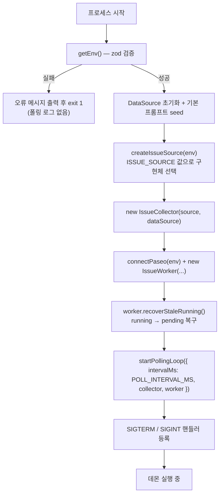
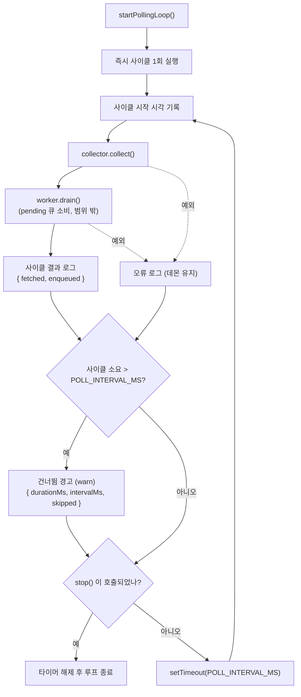
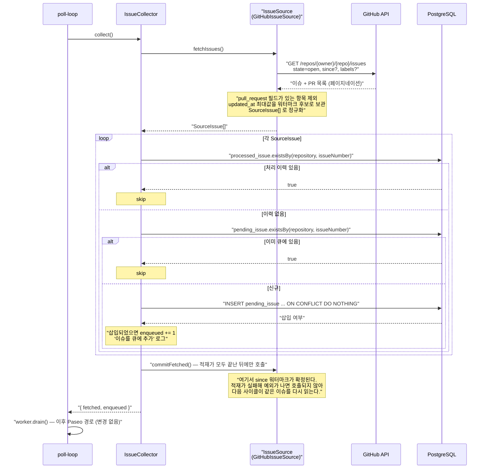
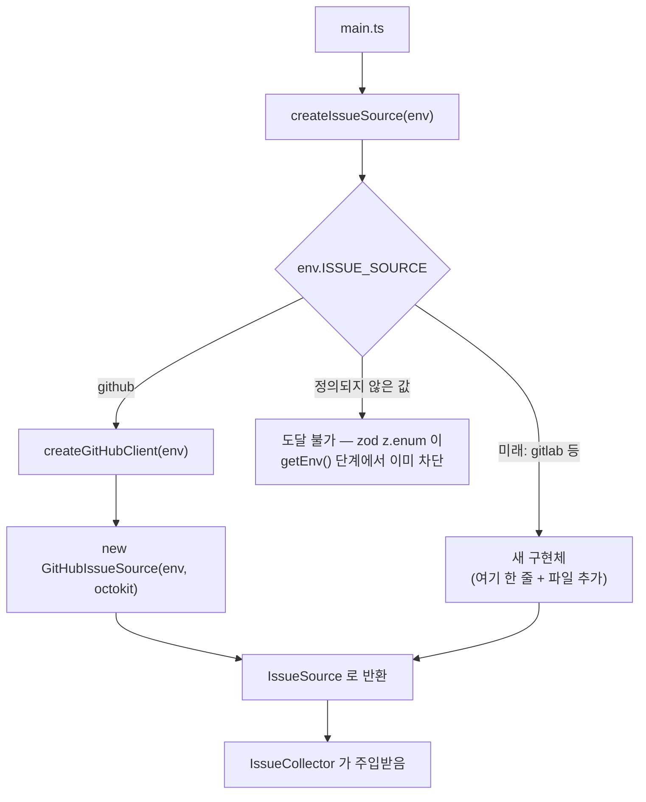
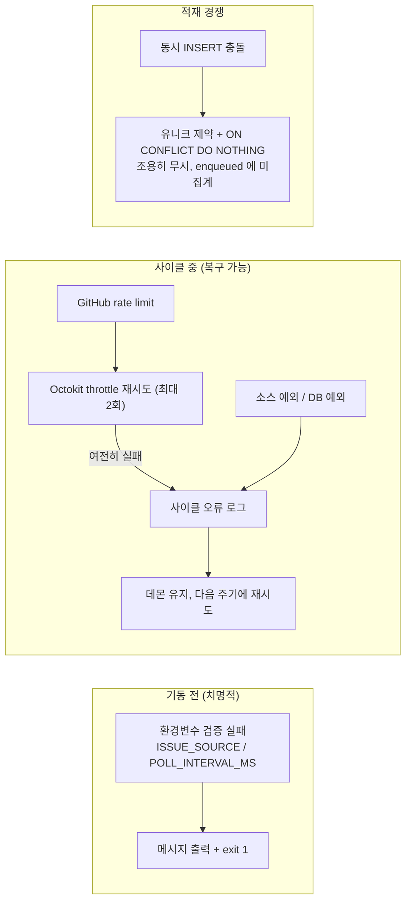

# FLOW CHART — 지속적 Issue 수집 (Issue 소스 추상화 + Polling 주기 환경변수화)

- 작성: 2026-09-12 17:13

## 1. 기동 흐름

환경변수 검증이 가장 먼저 일어나 잘못된 `ISSUE_SOURCE`·`POLL_INTERVAL_MS`는 **폴링이 시작되기 전에** 프로세스를 종료시킨다 (AC-04, AC-08).

## 2. 폴링 루프 — 정상 흐름과 분기

기동 즉시 1회 실행하고, 사이클이 **끝난 뒤** `POLL_INTERVAL_MS` 뒤로 다음 사이클을 예약한다. 재예약 방식이라 사이클이 주기보다 길어도 겹치지 않는다 (AC-09, AC-11).

사이클이 **끝난 뒤에** 다음 사이클을 예약하므로 두 사이클이 동시에 도는 경로가 없다. 대신 사이클이 주기보다 오래 걸리면 그 사이 돌았어야 할 주기를 지나치게 되므로, 소요 시간과 건너뛴 주기 수를 경고로 남긴다.

## 3. 한 사이클 내부 — 소스 조회부터 큐 적재까지

`IssueCollector`는 `IssueSource` 인터페이스만 호출하고, provider 고유 처리(PR 제외, 라벨 필터, `since`)는 전부 구현체 안에서 끝난다 (AC-01, AC-02, AC-05, AC-06, AC-10).

## 4. 소스 선택 (확장 지점)

새 소스를 추가할 때 손대는 프로덕션 파일은 **팩토리와 새 구현체뿐**이다. `main.ts`, `IssueCollector`, `poll-loop`는 그대로다 (AC-03).

## 5. 오류 흐름 요약

## 변경 이력

| 일시 | Iteration | 변경 내용 | 이유 |
|---|---|---|---|
| — | — | 최초 작성 | — |
| 2026-09-12 17:34 | 2 | 2절 플로우차트에서 도달 불가한 "이미 실행 중인가?" 분기를 빼고, 사이클 소요가 주기를 넘었을 때의 건너뜀 경고 분기를 그림 | 재예약 방식에서는 겹치는 tick이 없어 해당 분기가 실제로 존재하지 않았다 (Iteration 1 F-01) |
| 2026-09-12 17:34 | 2 | 3절 시퀀스에 `commitFetched()` 호출과 워터마크 확정 시점을 추가 | 워터마크가 적재 전에 전진해 이슈가 영구 누락될 수 있었다 (Iteration 1 F-02) |
