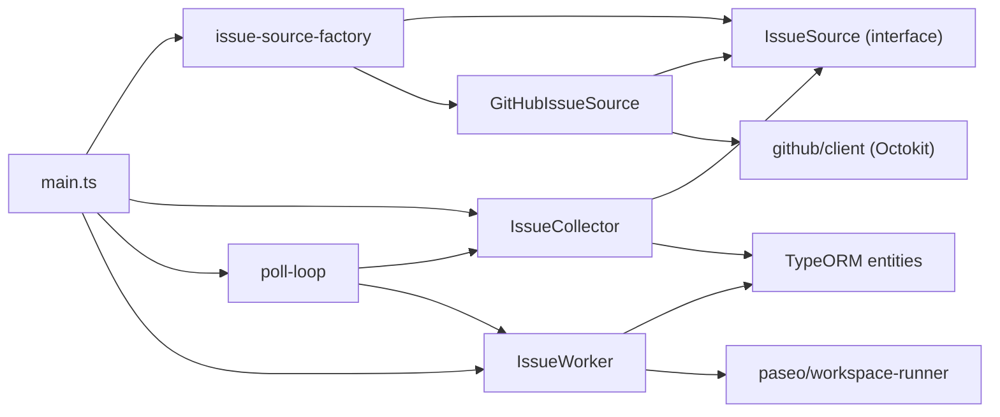
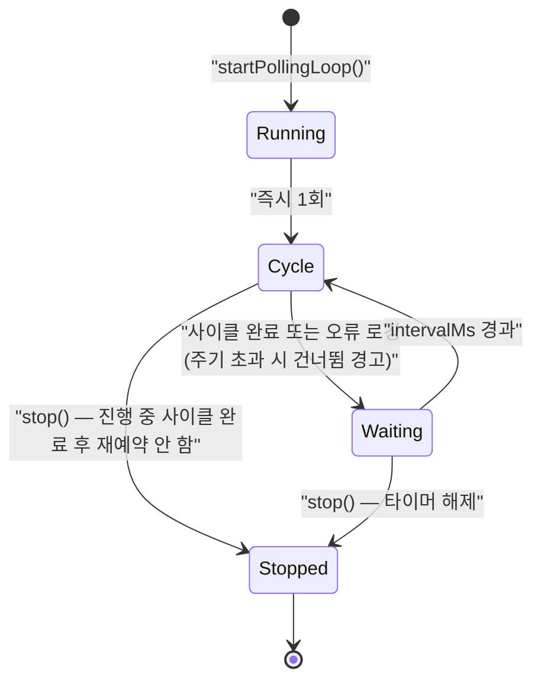

# SOFTWARE ARCHITECTURE — 지속적 Issue 수집 (Issue 소스 추상화 + Polling 주기 환경변수화)

- 작성: 2026-09-12 17:13

## 1. 개요

데몬의 루프 1단계(Polling)를 네 조각으로 분해한다.

```
[스케줄러] --(주기)--> [IssueCollector] --(IssueSource 인터페이스)--> [GitHubIssueSource] --> GitHub API
                             |
                             +--> PostgreSQL (pending_issue / processed_issue)
```

기존과 달라지는 점은 셋이다.

1. **소스 추상화**: GitHub 조회 로직이 `IssueSource` 인터페이스 뒤로 들어가고, 수집 파이프라인·스케줄러는 인터페이스에만 의존한다. 구현체 선택은 `createIssueSource(env)` 팩토리 한 곳으로 모인다.
2. **관심사 분리**: 기존 `IssuePoller`가 한꺼번에 하던 (조회 · 중복 필터 · 큐 적재)를 (소스 = 조회·정규화) / (Collector = 중복 필터·큐 적재)로 나눈다. 중복 필터는 소스 종류와 무관한 관심사이므로 소스를 추가해도 다시 구현하지 않는다.
3. **주기 지정 방식**: cron 식(`POLL_CRON`, croner)에서 밀리초 인터벌(`POLL_INTERVAL_MS`, 기본 10000)로 바뀐다. croner 의존성은 제거된다.

루프 2·3단계(Paseo workspace 생성, 에이전트 실행)와 `IssueWorker`의 동작은 바뀌지 않는다. 스케줄러가 `worker.drain()`을 호출하는 배선도 그대로다.

## 2. 아키텍처 결정

### 2.1 Issue 소스 추상화의 경계

| 대안 | 장점 | 단점 |
|---|---|---|
| A. 소스는 **조회·정규화만**, 중복 필터·DB 적재는 Collector | 소스 구현체가 순수해 테스트·교체가 쉽다. 새 소스가 DB 스키마를 몰라도 된다. 중복 필터가 한 곳뿐이라 규칙이 갈라지지 않는다 | 사이클당 협력 객체가 2개로 늘어난다 |
| B. 소스가 조회부터 큐 적재까지 전부 담당 (기존 `IssuePoller` 구조) | 클래스 하나로 끝난다. 변경량이 적다 | 새 소스마다 중복 필터·TypeORM 코드를 복제해야 한다. AC-02("파이프라인이 인터페이스에만 의존")를 만족시킬 지점이 사라진다 |
| C. 소스가 조회만 하고 정규화는 Collector가 담당 | 소스가 더 얇아진다 | Collector가 provider별 응답 형태를 알아야 해 결합이 되살아난다. provider 중립성(AC-01)이 깨진다 |

- **선택**: A
- **근거**: AC-01(시그니처에 Octokit 타입 없음), AC-02(Collector·스케줄러에 GitHub import 0건), AC-10(중복 필터 동작)을 동시에 만족시키는 유일한 분해다. EXPLORE A-05와도 일치한다. CLAUDE.md가 "이미 처리한 이슈는 DB 이력으로 필터링"을 루프의 성질로 규정하므로, 그 책임은 소스가 아니라 파이프라인에 있어야 한다.

### 2.2 인터페이스 형태 (TS interface vs 추상 클래스)

| 대안 | 장점 | 단점 |
|---|---|---|
| A. `interface IssueSource` + 각 구현체가 `implements` | 런타임 코드 0. ESM·`type`-only import과 잘 맞고 기존 코드(`EntitySchema` 기반, 상속 없음)의 결과 지향 스타일과 일관 | 공통 동작을 상속으로 재사용할 수 없다 |
| B. `abstract class IssueSource` | 공통 헬퍼(로깅, 워터마크)를 상속으로 공유 | 현재 공유할 공통 동작이 없다. 상속 계층이 이른 추상화가 된다 |

- **선택**: A
- **근거**: 지금 공유할 공통 구현이 없다. 기존 코드베이스는 클래스 상속을 쓰지 않으며(`IssuePoller`, `IssueWorker` 모두 단독 클래스), 인터페이스는 컴파일 후 코드가 남지 않아 번들에도 유리하다.

### 2.3 소스 선택 방식 (팩토리)

| 대안 | 장점 | 단점 |
|---|---|---|
| A. `createIssueSource(env)` **팩토리 함수 + `ISSUE_SOURCE` 환경변수 스위치** | 확장 지점이 한 파일. `satisfies Record<Env["ISSUE_SOURCE"], Factory>`로 새 값 추가 시 컴파일 오류가 나 누락을 막는다. 설정으로 전환 가능 | 구현체가 많아지면 팩토리가 모든 구현체를 import 해 번들이 커진다 |
| B. 레지스트리에 구현체가 스스로 등록 (self-registering) | 팩토리 파일 수정 없이 추가 가능 | 부수효과 import에 의존해 tree-shaking·초기화 순서가 불투명해진다. 구현체 1개인 현재에는 과설계 |
| C. main에서 직접 `new GitHubIssueSource(...)` | 가장 단순 | AC-03 위반(main이 구현체를 직접 import). 소스 교체 시 배선 코드를 고쳐야 한다 |

- **선택**: A
- **근거**: AC-03·AC-04를 직접 만족한다. 구현체가 1개인 지금 B의 동적 등록은 이득 없이 추적성만 떨어뜨린다. zod `z.enum`으로 허용 값을 제한하면 잘못된 값이 **폴링 시작 전** 기동 실패로 이어져 AC-04 후반부도 스키마 한 줄로 해결된다.

### 2.4 폴링 스케줄러 구현

| 대안 | 장점 | 단점 |
|---|---|---|
| A. **`setTimeout` 자기 재예약(self-rescheduling)** — 사이클 종료 후 `intervalMs` 뒤 다음 사이클 예약 | 겹침이 구조적으로 불가능(AC-11). 사이클이 길어져도 "밀린 사이클 폭주"가 없다. 의존성 0. `unref()`/`clearTimeout`으로 정지가 깔끔(AC-09 정지 조건) | 주기가 "시작 간격"이 아니라 "종료→시작 간격"이라 사이클 소요시간만큼 실제 주기가 길어진다 |
| B. `setInterval` + 실행 중 플래그로 건너뛰기 | 주기가 벽시계 기준으로 일정하다 | 사이클이 길면 tick이 계속 발생·폐기된다. 타이머 드리프트 처리 코드가 따로 필요 |
| C. croner 유지, `POLL_INTERVAL_MS`를 초 단위 6필드 cron으로 변환 | 기존 `protect: true` 재사용 | ms→cron 변환이 10초 미만·비정수 초를 표현 못 한다. 의존성을 남기려고 간접 계층을 두는 셈 |

- **선택**: A
- **근거**: AC-11(겹침 없음)이 코드 구조로 보장된다. B는 같은 결과를 "감시 플래그"라는 규율로 달성해 실수 여지가 크다. 주기의 의미 차이는 README에 한 줄로 명시한다(기존 croner `protect: true`도 사실상 같은 성질이었다). 기본 10초 주기에서 사이클은 보통 1초 미만이라 실질 차이는 무시할 수준이다.
- **겹침 대신 "건너뜀"을 로그로 알린다**: 재예약 방식에서는 겹치는 tick이 발생하지 않으므로 "실행 중이면 건너뛴다"는 가드 자체가 도달할 수 없는 코드가 된다. 대신 사이클 소요 시간을 재서 주기를 초과했으면 건너뛴 주기 수와 함께 `warn`으로 남긴다(AC-11 후반부). 운영자가 기본 `LOG_LEVEL=info`에서도 "폴링이 설정한 주기를 못 따라가고 있다"는 사실을 볼 수 있어야 하므로 `debug`가 아닌 `warn`을 쓴다.

### 2.5 폴링 사이클의 오류 경계

| 대안 | 장점 | 단점 |
|---|---|---|
| A. **사이클 전체를 try/catch**로 감싸 로그만 남기고 다음 주기 계속 (기존 `startLoop`와 동일) | 데몬이 죽지 않는다(AC-12). 기존 동작과 일관 | 영구적 설정 오류도 조용히 반복될 수 있다 |
| B. 오류 종류별 분기(인증 오류는 즉시 종료, 일시 오류는 계속) | 잘못된 토큰을 빨리 드러낸다 | provider별 오류 분류가 소스 밖으로 새어 나와 추상화를 해친다. 인수 조건에 없다 |

- **선택**: A
- **근거**: AC-12가 "오류를 로그로 남기고 다음 주기 계속"을 요구한다. B의 오류 분류는 provider 지식을 스케줄러로 끌어올려 AC-02와 충돌한다. 설정 오류 조기 노출은 zod 기동 검증(AC-04, AC-08)이 이미 담당한다.

### 2.6 증분 조회(`since` 워터마크)의 소유자

| 대안 | 장점 | 단점 |
|---|---|---|
| A. **소스 구현체 내부 상태**로 유지 (기존과 동일) | 워터마크 의미(`updated_at` 기준)가 provider마다 다르므로 소스가 아는 것이 맞다. 인터페이스가 단순해진다(AC-01) | 재기동 시 초기화되어 첫 사이클이 전체 조회가 된다 |
| B. Collector가 워터마크를 관리해 소스에 전달 | 재기동 후에도 DB에 영속화하기 쉽다 | 인터페이스에 provider 특유의 시간 시맨틱이 새어 나온다. 범위 제외 항목(영속화)을 끌어들인다 |

- **선택**: A
- **근거**: EXPLORE A-04와 일치하고 AC-01을 지킨다. 재기동 후 전체 조회 비용은 중복 필터(AC-10)가 흡수하며, 10초 주기에서도 `since`가 대부분의 사이클을 빈 응답으로 만들어 rate limit 위험을 낮춘다.

**워터마크를 전진시키는 시점**은 조회 직후가 아니라 **적재가 끝난 뒤**다. 조회 직후에 전진시키면, 적재가 DB 오류로 실패한 사이클의 이슈들이 다음 조회에서 `since`에 걸려 빠지고(루프는 오류를 삼키고 계속 돈다 — 2.5) 그 이슈가 다시 갱신되기 전까지 영영 큐에 들어가지 못한다. 그래서 인터페이스에 `commitFetched?()`를 두어, 수집기가 한 배치의 적재를 모두 마친 뒤에만 호출한다.

| 대안 | 장점 | 단점 |
|---|---|---|
| A. **인터페이스에 선택적 `commitFetched?()`를 두고 수집기가 적재 성공 후 호출** | 확정 시점이 명시적이다. 워터마크의 의미(무엇을 기준으로 증분하는지)는 여전히 구현체 안에만 있어 provider 중립성(AC-01)이 유지된다. 증분 조회를 하지 않는 소스는 구현하지 않아도 된다 | 인터페이스 메서드가 하나 늘고, 수집기가 "한 배치"라는 개념을 알아야 한다 |
| B. `fetchIssues()`가 커밋 콜백을 함께 돌려준다 | 배치와 커밋이 한 값으로 묶인다 | 반환 타입이 `{ issues, commit }`으로 복잡해지고, 소스를 쓰는 모든 코드가 튜플을 풀어야 한다 |
| C. 수집기가 처리한 이슈 목록을 소스에 되돌려 준다 | 부분 성공까지 표현할 수 있다 | 소스가 "어떤 이슈까지 처리됐는지"를 해석해야 해 로직이 provider마다 갈라진다. 현재 적재는 전부 성공 아니면 예외라 부분 성공 표현이 필요 없다 |

- **선택**: A.

### 2.7 모듈 배치

| 대안 | 장점 | 단점 |
|---|---|---|
| A. **`src/issues/`** 신설 (types, issue-source, issue-source-factory, issue-collector, sources/github-issue-source) + `src/github/client.ts`는 유지 | 도메인(이슈 수집) 기준 응집. provider 구현은 `sources/` 하위로 격리되어 추가 지점이 명확 | 디렉토리가 하나 늘고 기존 `src/github/`와 역할 경계 설명이 필요 |
| B. 기존 `src/github/` 안에서 파일만 분리 | 이동이 적다 | 소스 중립 모듈(Collector, 인터페이스)이 `github/` 아래 놓여 이름이 거짓말을 한다 |

- **선택**: A. `src/github/client.ts`(Octokit 생성·throttle 설정)는 GitHub 전송 계층이므로 `src/github/`에 남기고, GitHub 소스 구현체가 이를 주입받는다. `src/github/issue-poller.ts`는 삭제한다.
- **근거**: AC-02의 grep 검증이 디렉토리 경계로 자명해진다. 새 provider는 `src/<provider>/client.ts` + `src/issues/sources/<provider>-issue-source.ts` + 팩토리 한 줄이라는 반복 가능한 패턴을 얻는다.

## 3. 서비스 구성

| 서비스 | 역할 | 실행 형태 (Host / Docker) |
|---|---|---|
| 앱 데몬 (loop-using-paseo) | 폴링·수집·큐 적재, 이슈 작업 실행 오케스트레이션 | Host: `node dist/main.js` 또는 `npm run dev` / Docker: `app` 서비스 (`env_file: .env`) |
| GitHub API | Issue 원본 (이번 작업의 유일한 소스 구현체 대상) | 외부 SaaS 또는 GitHub Enterprise Server (`GITHUB_API_BASE_URL`) |
| PostgreSQL | `pending_issue`, `processed_issue`, `prompt_version` 저장 | Host: 로컬/원격 인스턴스 / Docker: `postgres` 서비스 |
| Paseo 데몬 | worktree 생성 및 AI 에이전트 실행 (이번 작업 범위 밖, 배선 유지) | Host: 별도 실행 / Docker: `paseo` 서비스 |

이번 작업으로 **서비스 구성은 바뀌지 않는다**. 새 환경변수 두 개(`ISSUE_SOURCE`, `POLL_INTERVAL_MS`)가 앱 데몬에 추가로 주입될 뿐이며, Docker 경로는 `app` 서비스의 `env_file: .env`로 자동 전달된다(AC-14).

## 4. 서비스 내부 구조

### 앱 데몬

```
main.ts  (합성 루트: 여기서만 구현체를 조립한다)
  │
  ├── config/env.ts ─────────── zod 스키마. POLL_INTERVAL_MS(기본 10000), ISSUE_SOURCE(기본 github)
  │
  ├── issues/
  │    ├── types.ts ─────────── SourceIssue (provider 중립 정규화 타입)
  │    ├── issue-source.ts ──── interface IssueSource { name; fetchIssues(); commitFetched?() }
  │    ├── issue-source-factory.ts ── createIssueSource(env): IssueSource   ← 확장 지점 (유일)
  │    ├── issue-collector.ts ─ IssueCollector.collect(): Promise<PollResult>
  │    └── sources/
  │         └── github-issue-source.ts ── GitHubIssueSource implements IssueSource
  │
  ├── github/client.ts ──────── Octokit 생성 (throttle/retry). GitHub 소스만 의존
  ├── scheduler/poll-loop.ts ── startPollingLoop({ intervalMs, collector, worker }): PollingLoop
  └── worker/issue-worker.ts ── (변경 없음) pending 큐 소비 → Paseo 실행
```

**의존 방향** (화살표는 "…에 의존한다")



- `IssueCollector`와 `poll-loop`는 `IssueSource` 인터페이스만 본다. 두 파일에 GitHub·Octokit import이 없다 (AC-02).
- `GitHubIssueSource`는 TypeORM을 모른다. DB 스키마 지식은 `IssueCollector`에만 있다.
- 구현체를 아는 프로덕션 파일은 `issue-source-factory.ts` 하나다 (AC-03).

**주요 컴포넌트 책임**

| 컴포넌트 | 책임 | 하지 않는 것 |
|---|---|---|
| `IssueSource` (interface) | "지금 처리 후보인 이슈 목록"을 provider 중립 타입으로 약속하고, 그 배치가 처리되었음을 `commitFetched?()`로 돌려받음 | 중복 판정, DB 접근, 스케줄링 |
| `GitHubIssueSource` | Octokit 페이지네이션, `state=open`·라벨 필터, PR 제외, `SourceIssue` 정규화, `commitFetched()`에서 `since` 워터마크 확정 | DB 접근, 재시도 정책(Octokit 플러그인이 담당) |
| `createIssueSource` | `ISSUE_SOURCE` 값 → 구현체 조립(클라이언트 생성 포함) | 조회, 필터 |
| `IssueCollector` | `processed_issue`/`pending_issue` 중복 필터, `pending_issue` 적재(`orIgnore`), 적재 완료 후 `commitFetched?()` 호출, `{fetched, enqueued}` 집계 | provider 응답 해석 |
| `poll-loop` | 기동 즉시 1회 + 종료 후 `intervalMs` 재예약, 사이클 소요가 주기를 넘으면 건너뜀 경고, 사이클 오류 격리, `stop()` | 이슈 해석, DB 접근 |

### 폴링 루프 상태



## 5. 서비스 간 인터페이스

| 호출자 → 대상 | 프로토콜 | 인터페이스 | 오류 처리 |
|---|---|---|---|
| `GitHubIssueSource` → GitHub API | HTTPS (REST v3), Octokit | `GET /repos/{owner}/{repo}/issues` — `state=open`, `sort=created`, `direction=asc`, `per_page=100`, 선택적 `since`, `labels`. 응답에서 `pull_request` 필드가 있는 항목은 제외 | rate limit / secondary rate limit은 Octokit throttle 플러그인이 최대 2회 재시도. 그 외 오류는 그대로 throw → 스케줄러가 사이클 단위로 잡아 로그 후 다음 주기 계속 (AC-12) |
| `IssueCollector` → PostgreSQL | TCP, TypeORM (`pg`) | `processed_issue.existsBy`, `pending_issue.existsBy`, `INSERT ... ON CONFLICT DO NOTHING` (`orIgnore`) | 삽입 경쟁은 유니크 제약이 최종 방어선. 연결 오류는 throw → 사이클 오류로 격리 |
| `IssueWorker` → Paseo 데몬 | WebSocket (`ws`/`wss`, `PASEO_HOST`/`USE_TLS`) | Paseo SDK `@getpaseo/client` — workspace 생성(`BASE_BRANCH` 기준 worktree) 후 프롬프트 전달 | **변경 없음** |
| 운영자 → 앱 데몬 | 환경변수 (Host: `--env-file`, Docker: `env_file`/`environment`) | `ISSUE_SOURCE`, `POLL_INTERVAL_MS` 신설. `POLL_CRON` 폐지 | zod 검증 실패 시 기동 전 종료 코드 1 (AC-04, AC-08) |

## 변경 이력

| 일시 | Iteration | 변경 내용 | 이유 |
|---|---|---|---|
| — | — | 최초 작성 | — |
| 2026-09-12 17:34 | 2 | 2.4에서 "보조 가드 플래그" 문구를 빼고, 주기 초과 시 건너뛴 주기 수를 `warn`으로 남기는 결정을 추가. 4절 상태 다이어그램·컴포넌트 책임 갱신 | 재예약 방식에서는 겹치는 tick이 없어 "실행 중이면 건너뛴다" 가드가 도달 불가 코드였고, 그 결과 AC-11 후반부("건너뛴 사이클이 로그로 확인된다")를 만족하지 못했다 (Iteration 1 F-01) |
| 2026-09-12 17:34 | 2 | 2.6에 워터마크 확정 시점 결정(`commitFetched?()`)과 대안 비교를 추가. 4절 인터페이스 서술·책임 표 갱신 | 워터마크를 조회 직후에 전진시키면 적재가 실패한 사이클의 이슈가 영구 누락된다. 기준 커밋(`issue-poller.ts`)은 적재 후 갱신이었으므로 분리 과정에서 생긴 회귀였다 (Iteration 1 F-02) |
