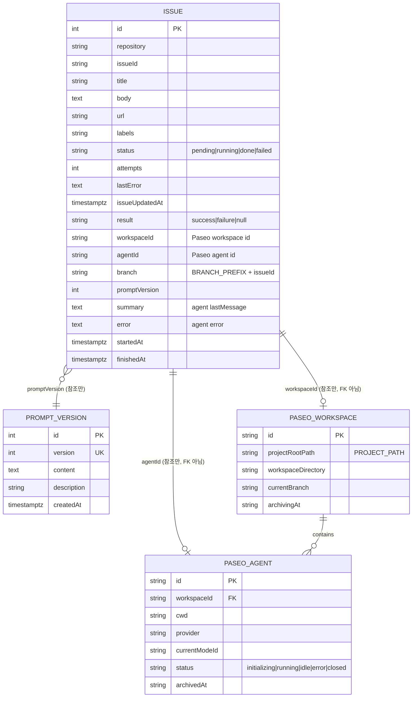

# DATA ARCHITECTURE — Paseo SDK 에이전트 명령 전달 모듈

- 작성: 2026-09-17 09:37

## 1. 개요

저장소는 PostgreSQL(TypeORM) 하나이며 이번 작업은 **스키마를 바꾸지 않는다**. 모듈이 만드는 데이터는 두 종류다.

- **DB(`issue` 행)**: 워커가 실행 결과를 기존 컬럼(`status`, `result`, `workspaceId`, `agentId`, `branch`, `promptVersion`, `summary`, `error`, `lastError`, `startedAt`, `finishedAt`)에 기록한다. 컬럼 추가 없음. 토큰 사용량은 로그로만 남긴다(범위 제외).
- **Paseo 데몬 상태(외부)**: workspace(worktree 디렉터리 + 브랜치)와 에이전트 세션. 앱은 이를 소유하지 않고 SDK로 생성·조회·아카이브만 한다.

## 2. 데이터 모델

| 엔티티 | 필드 | 타입 | 제약 | 설명 |
|---|---|---|---|---|
| `issue` | (모두 기존) | - | `UQ(repository, issueId)`, `IDX(status)` | 변경 없음. 아래 "수명주기"에서 모듈이 쓰는 컬럼만 서술 |
| `prompt_version` | (모두 기존) | - | `UQ(version)` | 변경 없음. 워커가 최대 `version`을 읽어 렌더링 |
| Paseo workspace | `id`, `projectRootPath`, `workspaceDirectory`, `gitRuntime.currentBranch`, `worktreeSlug`, `archivingAt` | SDK `WorkspaceDescriptorPayload` | 데몬 소유 | 재사용 판정 키: `projectRootPath` + `currentBranch` |
| Paseo agent | `id`, `workspaceId`, `cwd`, `provider`, `currentModeId`, `status`, `pendingPermissions[]`, `lastUsage`, `archivedAt`, `labels` | SDK `AgentSnapshotPayload` | 데몬 소유 | `labels = { issueId, branch }`로 역추적 가능 |

**메모리 내 계약 (`app/src/paseo/agent-runner.ts`)**

| 타입 | 필드 | 설명 |
|---|---|---|
| `AgentRunInput` | `issueId: string`, `title: string`, `prompt: string` | 워커가 렌더링한 프롬프트를 넘긴다 |
| `AgentRunStatus` | `"success" \| "error" \| "permission" \| "timeout" \| "cancelled"` | SDK `idle→success`, 나머지는 동명, 취소는 모듈이 추가 |
| `AgentRunOutcome` | `status`, `raw: WaitStatus \| null`, `workspaceId: string \| null`, `workspaceDirectory: string \| null`, `agentId: string \| null`, `branch`, `lastMessage: string \| null`, `error: string \| null`, `usage: AgentUsage \| null` | `raw`는 취소 시 null. `workspaceId`/`agentId`는 해당 단계 전에 취소되면 null (워커는 취소 결과에서 id를 쓰지 않는다) |
| `AgentRunError` | `stage: "workspace" \| "agent" \| "wait"`, `cause` | 메시지 `[stage] 원인` |

## 3. 데이터 수명주기

| 시점 | 주체 | DB(`issue`) | Paseo |
|---|---|---|---|
| 큐 적재 | `IssueCollector` | `pending` 행 생성 (기존) | - |
| 처리 시작 | `IssueWorker.process` | `pending→running`, `attempts+1`, `startedAt` (기존) | - |
| workspace 확보 | `PaseoAgentRunner.resolveWorkspace` | - | 기존 workspace 재사용 또는 생성(worktree 디렉터리 + 브랜치) |
| 에이전트 생성 | `PaseoAgentRunner.createAgent` | - | 에이전트 세션 생성, 첫 프롬프트 전달 |
| 완료 | `IssueWorker` | `done` + `result/workspaceId/agentId/branch/promptVersion/summary/error/finishedAt` | 에이전트 `archive()` (`AGENT_ARCHIVE_AFTER_RUN=true`). workspace 유지 |
| 취소 | `IssueWorker` | `pending`, `lastError` | 에이전트 그대로(데몬에서 계속 실행). 다음 기동 시 같은 workspace 재사용 |
| 모듈 예외 | `IssueWorker` | `pending`(재시도) 또는 `failed`(시도 초과), `lastError` | 생성된 것이 있으면 그대로 남음. 재시도 시 재사용 |
| 비정상 종료 복구 | `recoverStaleRunning` | `running→pending` (기존) | - |
| 삭제 | 없음 | 행 유지(이력) | workspace·에이전트 삭제는 운영자가 Paseo에서 수행 |

## 4. 마이그레이션

스키마 변경이 없으므로 마이그레이션이 없다. `DB_SYNCHRONIZE=true` 환경도 영향 없음. 롤백은 코드만 되돌리면 된다.

## 5. 정합성과 동시성

- **이슈 클레임**: `update({ id, status: "pending" }, { status: "running" })`의 `affected`로 원자적 클레임 (기존).
- **workspace 재사용의 경합**: `MAX_CONCURRENT_ISSUES > 1`이어도 이슈마다 브랜치가 다르므로 같은 브랜치의 workspace를 두 실행이 동시에 만들 일은 없다(같은 이슈는 클레임으로 한 번에 하나만 처리). 재기동 직후 취소된 이슈가 재처리될 때는 기존 workspace를 찾아 재사용한다.
- **`workspaceId`/`agentId` 기록**: 마지막 실행의 값으로 덮어쓴다. 재사용 시 `workspaceId`는 같고 `agentId`는 새 값이다.
- **취소와 DB**: 취소 결과는 `done`이 아닌 `pending`으로 되돌리므로 완료 이력이 잘못 남지 않는다. `attempts`는 되돌리지 않는다(취소가 반복되면 시도 초과로 `failed`가 될 수 있으나, 이는 종료가 반복되는 비정상 상황에서만 발생하며 운영자가 README의 SQL로 되돌릴 수 있다).

## 6. 결정과 근거

| 영역 | 대안 | 선택·근거 |
|---|---|---|
| 토큰 사용량 저장 | A. `issue`에 `usage` jsonb 컬럼 추가 / B. 로그만 | **B**. 인수 조건 범위 제외. 스키마 불변(AC-17) |
| workspace ↔ issue 연결 | A. DB에 workspace 테이블 추가 / B. `issue.workspaceId` + Paseo 측 `labels`로 양방향 참조 | **B**. 기존 컬럼으로 충분하고 Paseo가 소유한 상태를 앱 DB에 복제하면 정합성 문제가 생긴다 |
| 재사용 판정 키 | A. DB의 `issue.workspaceId`로 `workspaces.ref(id)` / B. Paseo 목록에서 브랜치로 탐색 | **B만 채택**. DB 값은 아카이브·삭제된 workspace를 가리킬 수 있어 Paseo가 현재 가진 목록이 진실이다. A를 보조 경로로 두는 안(`previousWorkspaceId?` 입력)은 AC-09가 B만으로 충족되어 구현하지 않았고 후속 과제로 넘긴다 |
| 모델 미지정 시 `provider/model` 완성 | A. `WORKER_MODEL` 필수화 / B. 데몬 `providers.listModels`의 기본 모델로 완성 | **B**. 저장 데이터에는 영향 없음(`issue` 컬럼에 모델을 남기지 않는다). 상세는 `SOFTWARE_ARCHITECTURE.md` 2.6a |
| 취소 결과의 DB 상태 | A. `running` 유지 후 기동 복구 / B. 즉시 `pending` | **B**. 정상 종료 경로에서는 굳이 복구 단계에 의존할 이유가 없고, 로그에 취소 사유를 남길 수 있다 |

## 변경 이력

| 일시 | Iteration | 변경 내용 | 이유 |
|---|---|---|---|
| 2026-09-17 10:05 | 2 | §2 메모리 계약: `AgentRunOutcome.workspaceId`/`agentId`를 `string \| null`로 완화 | Gate 피드백 4(F-06). 취소 신호를 workspace·에이전트 생성 전에 확인해 생성 자체를 건너뛰므로 id가 없을 수 있다 |
| 2026-09-17 10:05 | 2 | §6 재사용 판정 키: 보조 경로 A(`previousWorkspaceId?`)를 "채택하지 않음, 후속 과제"로 정정. 모델 미지정 시 완성 결정 행 추가 | Gate 피드백 2(F-02). 구현은 목록 탐색만으로 AC-09를 충족하며 보조 경로는 인수 조건 밖이다 |
