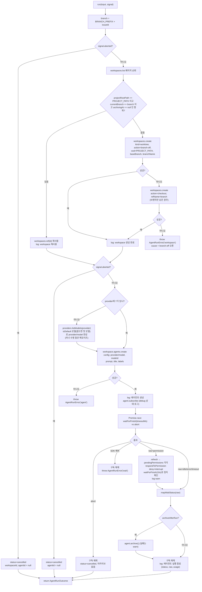
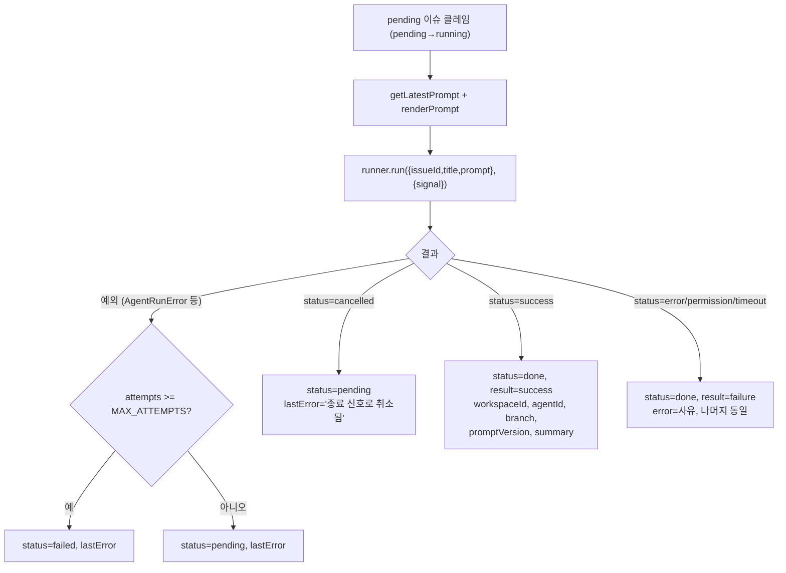
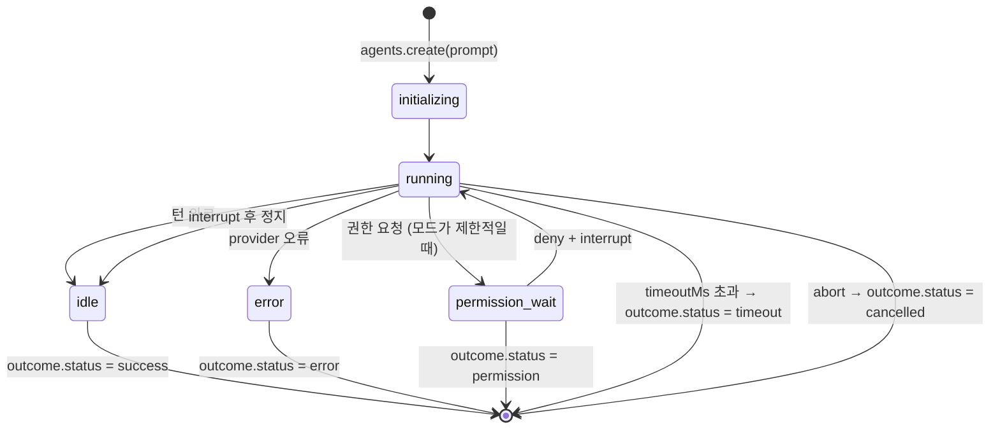

# FLOW CHART — Paseo SDK 에이전트 명령 전달 모듈

- 작성: 2026-09-17 09:38

## 1. 이슈 한 건의 명령 전달 (`PaseoAgentRunner.run`)

워커가 렌더링한 프롬프트와 이슈 정보를 받아 workspace 확보 → 에이전트 생성 → 완료 대기 → 정리 → 정규화 결과 반환까지의 흐름이다.



## 2. 워커의 결과 반영 (`IssueWorker.process`)



## 3. 종료 신호 처리 (`main.ts`)

```mermaid
sequenceDiagram
    participant OS
    participant main
    participant loop as PollingLoop
    participant worker as IssueWorker
    participant runner as PaseoAgentRunner
    participant paseo as Paseo 데몬

    OS->>main: SIGTERM
    main->>main: abortController.abort()
    main->>loop: stop()
    Note over worker,runner: 진행 중 run()의 Promise.race가 abort로 먼저 끝남
    runner-->>worker: outcome.status = cancelled
    worker->>worker: issue → pending, lastError 기록
    loop-->>main: 사이클 종료
    main->>paseo: client.close()
    Note over paseo: 에이전트는 데몬에서 계속 실행될 수 있음
    main->>OS: exit 0
```

## 4. 에이전트 상태와 결과 매핑



## 변경 이력

| 일시 | Iteration | 변경 내용 | 이유 |
|---|---|---|---|
| 2026-09-17 10:06 | 2 | 1절 흐름: `run()` 진입·에이전트 생성 직전 abort 분기, 모델 미지정 시 `providers.listModels`로 `provider/model` 완성 단계, `branch-off`·`checkout` 모두 실패 시 원래 오류를 `cause`로 남기는 표기 추가 | Gate 피드백 1(F-01), 4(F-06), 5(F-04)를 구현에 반영한 것과 일치시키기 위해 |
