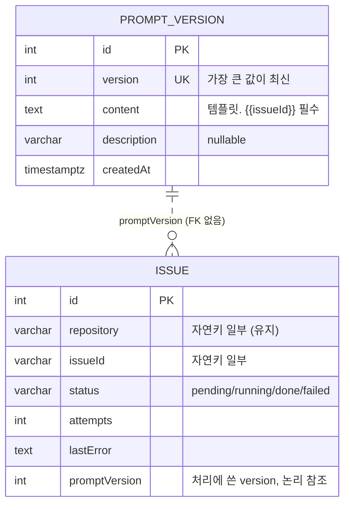

# DATA ARCHITECTURE — 프롬프트 관리 (PRM-001 ~ PRM-004)

- 작성: 2026-09-22 23:35

## 1. 개요

저장소는 PostgreSQL 하나이고 **스키마 변경은 없다.** 바뀌는 것은 데이터 수명주기다.
- 데몬이 `prompt_version`에 쓰는 일이 없어진다(built-in 시딩 제거). 이 테이블은 운영자만 쓴다.
- 처리 중 프롬프트를 쓸 수 없으면 `issue` 행을 선점 전 상태로 되돌리는 규칙이 추가된다.

## 2. 데이터 모델

| 엔티티 | 필드 | 타입 | 제약 | 설명 |
|---|---|---|---|---|
| prompt_version | version | integer | unique | 최신 판정 기준. 변경 없음 |
| prompt_version | content | text | not null | 템플릿. 데몬이 읽을 때 `{{issueId}}` 포함 여부를 검사한다(DB 제약 아님) |
| issue | repository | varchar(255) | unique(repository, issueId) | 프롬프트 자리표시자에서는 빠졌지만 자연키로 계속 쓴다 |
| issue | attempts | integer | default 0 | 프롬프트를 쓸 수 없어 되돌릴 때 선점 전 값으로 복원한다 |
| issue | promptVersion | integer | nullable | `done` 시 사용한 version. 변경 없음 |

## 3. 데이터 수명주기

| 데이터 | 생성 | 갱신 | 조회 | 삭제 |
|---|---|---|---|---|
| prompt_version | **운영자만**(README SQL). 데몬은 쓰지 않는다 | 없음(추가만 한다) | 데몬: 기동 시 1회 + 이슈 처리마다 1회(최신 1행) | 운영자. 모두 지우면 다음 처리 때 데몬이 종료되고, 다음 기동도 막힌다 |
| issue (되돌림) | - | 처리 중 `UnusablePromptError`: `running → pending`, `attempts = 선점 전 값`, `lastError = 오류 메시지` | - | - |

## 4. 마이그레이션

- 스키마 변경이 없으므로 마이그레이션은 필요 없다(`DB_SYNCHRONIZE` 동작도 그대로).
- 기존 데이터:
  - built-in v1이 이미 들어 있는 DB는 `{{issueId}}`가 있으므로 그대로 동작한다. 다만 옛 템플릿의 `{{repository}}` 줄은 원문으로 남고 처리마다 경고가 난다. README에 새 version으로 교체하라고 안내한다.
  - 빈 DB로 처음 기동하는 경우에는 운영자가 먼저 README SQL로 프롬프트를 등록해야 한다.
- 롤백: 코드를 되돌리면 기동 시 시딩이 다시 동작한다. 데이터 쪽에서 되돌릴 것은 없다.

## 5. 정합성과 동시성

- **최신 판정**: `version` unique 제약 + `ORDER BY version DESC LIMIT 1`. 같은 version은 DB가 거부한다(AC-05).
- **읽기 일관성**: 이슈마다 조회하고 캐시하지 않는다. 운영자 INSERT가 커밋된 뒤 시작된 처리부터 새 version을 쓴다(AC-06). 한 이슈 처리 안에서는 조회한 행 하나로 렌더링과 `promptVersion` 기록을 함께 하므로 서로 어긋나지 않는다.
- **이슈 되돌림**: 선점(`pending → running`, attempts+1)은 기존의 조건부 UPDATE다. 되돌림은 `id` 기준 UPDATE 한 번으로 `status`, `attempts`, `lastError`를 함께 바꾼다. 같은 이슈를 다른 워커가 동시에 잡는 일은 선점 규칙이 막는다.
- **동시 처리 중 치명 오류**(`MAX_CONCURRENT_ISSUES > 1`):
  - 오류를 만난 이슈는 되돌린다.
  - 이미 에이전트를 실행 중인 이슈는 abort로 `cancelled → pending`(기존 규칙)이 된다.
  - 아직 시작하지 않은 이슈는 선점하지 않은 채 반환한다. 결과적으로 `running`으로 남는 행이 없다. 비정상 종료로 남더라도 다음 기동의 `recoverStaleRunning`이 복구한다.

## 6. 결정과 근거

| 대안 | 판단 |
|---|---|
| A. 스키마 그대로, 검증은 앱에서(기동 시·처리 시) | **선택.** 요구사항이 "기동 시·처리 시 종료"이므로 앱 검사로 충분하다. 마이그레이션 체계(DAT-002)가 아직 없는 상태에서 스키마를 건드리지 않는다 |
| B. `content`에 `CHECK (content LIKE '%{{issueId}}%')` 추가 | 잘못된 INSERT를 막을 수 있지만 스키마 변경이 필요하다. 빈 이력은 막지 못해 앱 검사도 결국 필요하다. 범위 제외 항목 |
| C. `issue.promptVersion`에 FK 추가 | 운영자가 옛 version을 지우면 이력 기록이 막힌다. 요구사항과 무관하다 |

## 변경 이력

| 일시 | Iteration | 변경 내용 | 이유 |
|---|---|---|---|
