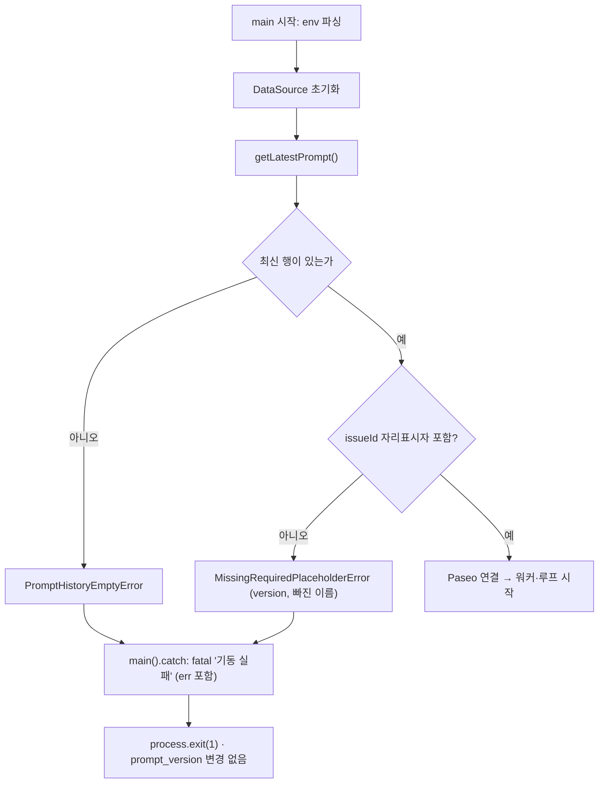
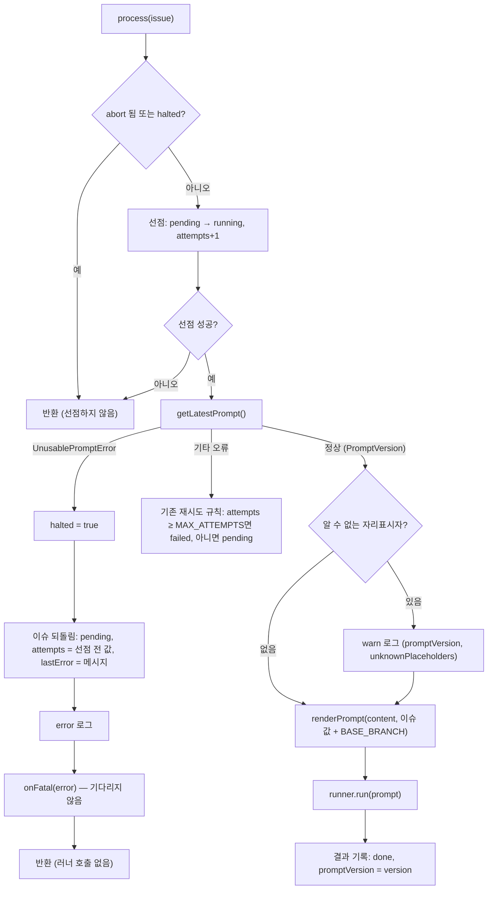
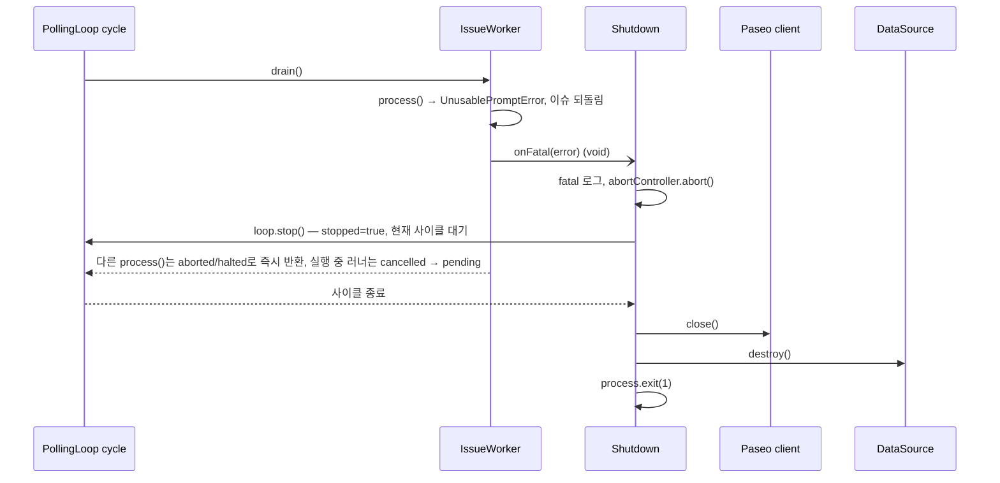
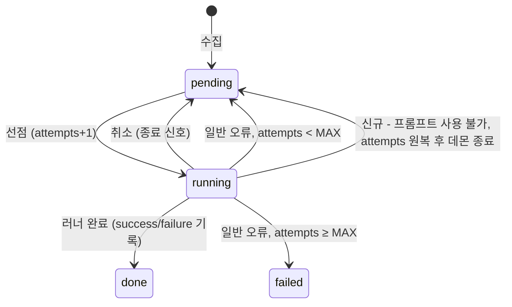

# FLOW CHART — 프롬프트 관리 (PRM-001 ~ PRM-004)

- 작성: 2026-09-22 23:35

## 1. 기동 시 프롬프트 검사 (AC-01, AC-02, AC-12)

DataSource를 초기화한 직후, Paseo에 연결하기 전에 최신 프롬프트를 검사한다. 검사에 실패하면 기존 기동 실패 경로로 끝난다.

## 2. 이슈 처리 중 프롬프트 선택·검증·렌더링 (AC-03, AC-06 ~ AC-08, AC-13, AC-14)

## 3. 치명 오류 종료 절차 (AC-03, AC-13)

`onFatal`은 폴링 사이클 안에서 호출된다. 종료 함수는 사이클이 끝나기를 기다리는데, 먼저 abort를 보내 진행 중인 에이전트 대기를 끊기 때문에 교착되지 않는다.

## 4. 이슈 상태 전이 (변경분 강조)

## 변경 이력

| 일시 | Iteration | 변경 내용 | 이유 |
|---|---|---|---|
