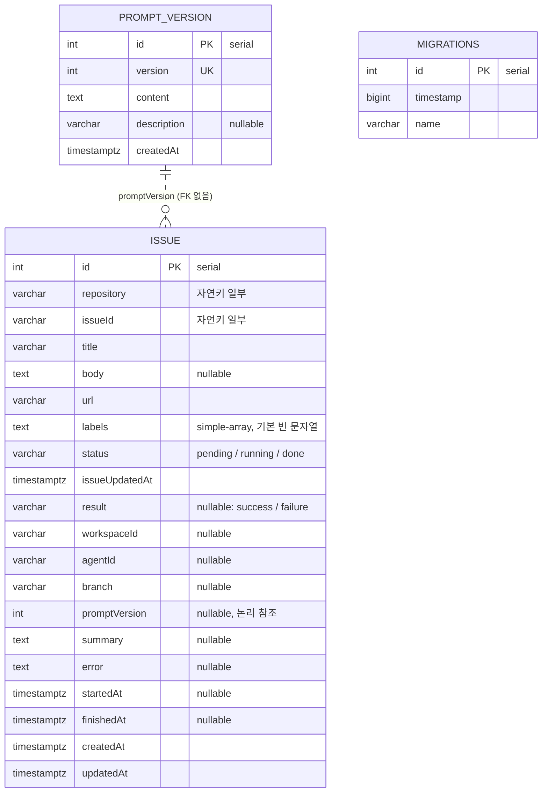

# DATA ARCHITECTURE — 데이터 저장과 스키마 관리 (DAT-001 ~ DAT-002)

- 작성: 2026-10-02 16:32

## 1. 개요

저장소는 PostgreSQL 하나다. `issue`·`prompt_version` 테이블의 **구조는 바꾸지 않는다.** 바뀌는 것은 스키마를 만드는 수단이다.

- 자동 동기화 방식(`DB_SYNCHRONIZE` 참, 기본): 기존과 같다.
- 마이그레이션 방식(`DB_SYNCHRONIZE` 거짓): baseline 마이그레이션이 같은 구조를 만들고, TypeORM이 적용 기록을 `migrations` 테이블에 남긴다. 이 방식에서만 `migrations` 테이블이 생긴다.

## 2. 데이터 모델

| 엔티티 | 필드 | 타입 | 제약 | 설명 |
|---|---|---|---|---|
| issue | id | serial | PK `PK_f80e086c249b9f3f3ff2fd321b7` | 큐 처리 순서 기준 |
| issue | repository, issueId | varchar(255), varchar(128) | NOT NULL, unique `UQ_issue_repo_issue_id` | 이슈 자연키. 중복 적재 방지 |
| issue | title, url | varchar(512) | NOT NULL | |
| issue | body | text | nullable | |
| issue | labels | text | NOT NULL, default `''` | 쉼표로 이은 라벨 |
| issue | status | varchar(16) | NOT NULL, default `'pending'`, index `IDX_issue_status` | `pending` → `running` → `done` |
| issue | issueUpdatedAt | timestamptz | NOT NULL | 소스의 갱신 시각 |
| issue | result | varchar(16) | nullable | `done`일 때 `success` / `failure` |
| issue | workspaceId, agentId | varchar(128) | nullable | |
| issue | branch | varchar(255) | nullable | |
| issue | promptVersion | integer | nullable | 처리에 쓴 프롬프트 version |
| issue | summary, error | text | nullable | 에이전트 요약, 실패 사유 |
| issue | startedAt, finishedAt | timestamptz | nullable | |
| issue | createdAt, updatedAt | timestamptz | NOT NULL, default `now()` | |
| prompt_version | id | serial | PK `PK_cb9ff9b4ab70babd62914aa97a5` | |
| prompt_version | version | integer | NOT NULL, unique `UQ_1c4aebce69bf91205bcd40f50be`, index `IDX_prompt_version_version` | 가장 큰 값이 최신 |
| prompt_version | content | text | NOT NULL | |
| prompt_version | description | varchar(512) | nullable | |
| prompt_version | createdAt | timestamptz | NOT NULL, default `now()` | |
| migrations | id, timestamp, name | serial, bigint, varchar | PK | TypeORM이 관리하는 적용 기록. 마이그레이션 방식에서만 존재 |

제약·인덱스 이름은 자동 동기화가 빈 DB에 실제로 내놓는 DDL에서 가져왔다(TypeORM 1.1.1, PostgreSQL 18.4에서 스키마 빌더 출력으로 확인). baseline 마이그레이션은 이 이름을 그대로 쓴다.

## 3. 데이터 수명주기

| 데이터 | 생성 | 갱신 | 조회 | 삭제 |
|---|---|---|---|---|
| issue | 수집기: 소스가 준 이슈 중 `(repository, issueId)`가 없는 것을 `pending`으로 INSERT | 워커: `pending → running`(선점), `running → done`(+결과), 취소·프롬프트 오류 시 `running → pending` | 워커: `pending`을 `id` 순으로. 수집기: 존재 여부 | 데몬은 지우지 않는다(이력으로 남긴다) |
| prompt_version | 운영자(README SQL) | 없음 | 데몬: 기동 시, 이슈 처리마다 | 운영자 |
| migrations | 데몬(마이그레이션 방식 기동 시 적용한 건마다 1행) | 없음 | 데몬(기동 시 미적용분 판별) | 없음 |

이번 작업으로 `issue`·`prompt_version`의 수명주기는 바뀌지 않는다.

## 4. 마이그레이션

### 4.1 방식 선택

| `DB_SYNCHRONIZE` | 기동 시 동작 | `migrations` 테이블 |
|---|---|---|
| 참 / 미지정 | TypeORM `synchronize`: 엔티티와 스키마를 비교해 테이블·컬럼·인덱스를 만들거나 고친다. **엔티티에 없는 컬럼은 지운다** | 만들지 않고 읽지 않는다 |
| 거짓 | 자동 동기화를 하지 않는다. `migrations` 테이블(없으면 생성)과 코드의 마이그레이션 목록을 비교해 미적용분을 순서대로, 한 트랜잭션으로 적용한다 | 적용한 건마다 1행 |

### 4.2 baseline 마이그레이션

- 클래스 `Baseline1790000000000`(`name`이 `migrations.name`에 기록된다). 타임스탬프는 적용 순서를 정하는 값이고, 이후 마이그레이션은 더 큰 값을 쓴다.
- `up`: 4개 문장.
  1. `CREATE TABLE IF NOT EXISTS "issue" (…)` — 2절의 컬럼·PK·unique 제약 포함
  2. `CREATE INDEX IF NOT EXISTS "IDX_issue_status" ON "issue" ("status")`
  3. `CREATE TABLE IF NOT EXISTS "prompt_version" (…)`
  4. `CREATE INDEX IF NOT EXISTS "IDX_prompt_version_version" ON "prompt_version" ("version")`
- `down`: 두 인덱스와 두 테이블을 지운다. 데몬은 `down`을 호출하지 않는다(되돌리기 수단은 범위 제외). TypeORM 인터페이스가 요구해서 둔다.

### 4.3 기존 데이터 처리

| 기존 DB 상태 | `DB_SYNCHRONIZE=false`로 기동하면 |
|---|---|
| 빈 DB | baseline이 테이블·인덱스를 만든다. `migrations` 1행 |
| 자동 동기화로 만든 DB (데이터 있음) | 테이블·인덱스가 이미 있어 `IF NOT EXISTS`가 건너뛴다. 데이터는 그대로이고 `migrations`에 baseline 1행이 기록된다. 이후 기동부터는 미적용분이 없다 |
| 마이그레이션 방식으로 쓰던 DB | 미적용분만 적용한다(없으면 0건) |

- 전환 방향은 자동 동기화 → 마이그레이션만 다룬다. 전환 직전에 자동 동기화 방식으로 한 번 기동해 스키마를 최신 엔티티에 맞춰 두어야 한다(`IF NOT EXISTS`는 구조 차이를 보지 않는다).
- 마이그레이션 방식으로 쓰는 DB를 다시 자동 동기화로 기동하면 스키마는 엔티티 기준으로 맞춰지고 `migrations` 테이블은 건드리지 않는다. 다만 마이그레이션이 엔티티에 없는 것을 만들었다면 자동 동기화가 지울 수 있으므로 한 DB에서 두 방식을 오가지 않도록 README에 적는다.

### 4.4 롤백

- 마이그레이션 실패: 전체가 한 트랜잭션이라 PostgreSQL이 DDL과 적용 기록을 함께 되돌린다. 데몬은 종료 코드 1로 끝나고, 원인을 고친 뒤 다시 기동하면 같은 지점부터 다시 적용한다.
- 코드 롤백(이번 변경을 되돌림): `synchronize: true` 고정으로 돌아간다. `migrations` 테이블은 남지만 쓰이지 않는다. `issue`·`prompt_version` 구조는 같으므로 데이터 조치는 필요 없다.

## 5. 정합성과 동시성

- **큐 중복 방지**: unique `(repository, issueId)` + `INSERT … ON CONFLICT DO NOTHING`. 변경 없음.
- **선점**: `UPDATE issue SET status='running' WHERE id=? AND status='pending'`의 영향 행 수로 판정. 변경 없음.
- **이력 보존**: 처리 결과는 같은 행에 UPDATE하고 DELETE하지 않는다. 변경 없음.
- **마이그레이션 원자성**: `transaction: "all"` — 미적용분 전체와 적용 기록이 한 트랜잭션이다.
- **마이그레이션 동시 실행**: 데몬은 인스턴스 하나로 운영한다(이슈 처리도 단일 워커 전제). 여러 인스턴스가 동시에 기동하는 경우의 잠금은 다루지 않는다.
- **스키마 준비와 처리의 순서**: 스키마 준비는 프롬프트 검사·Paseo 연결·폴링 루프보다 먼저 끝난다. 스키마가 준비되기 전에 큐를 읽거나 쓰는 코드는 없다.

## 6. 결정과 근거

| 결정 | 대안 | 근거 |
|---|---|---|
| 테이블 구조 변경 없음 | 큐/이력 분리, 컬럼 추가 | DAT-001은 현재 구조로 충족된다. 인수 조건 밖 변경을 하지 않는다 |
| baseline을 자동 동기화 DDL과 같은 이름·타입으로 작성 | `migration:generate`로 생성 | 생성 도구는 범위 제외다. 스키마 빌더 출력으로 실제 DDL을 확인해 옮기고, AC-08(덤프 비교, drift 0건)로 일치를 검증한다 |
| `IF NOT EXISTS` baseline | 운영자 수동 INSERT, 코드 분기 | 기존 DB 전환이 기동 한 번으로 끝나고 데이터를 지킨다(AC-09). SOFTWARE_ARCHITECTURE 2.4 |
| `migrations` 테이블 이름은 TypeORM 기본값 | `migrationsTableName` 지정 | 다른 테이블과 충돌하지 않고, 기본값이 TypeORM 문서·도구와 맞는다 |
| 기본값 `DB_SYNCHRONIZE=true` | 기본 `false` | 기존 배포의 동작과 README의 첫 기동 흐름을 지킨다. 사용자가 Plan 체크포인트에서 확정했다 |

## 변경 이력

| 일시 | Iteration | 변경 내용 | 이유 |
|---|---|---|---|
