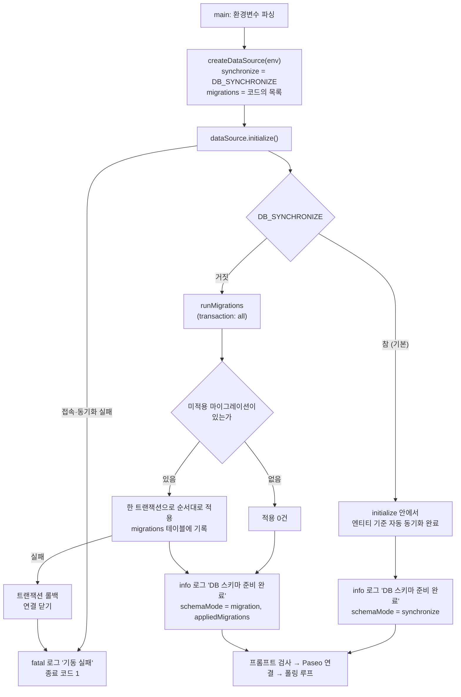
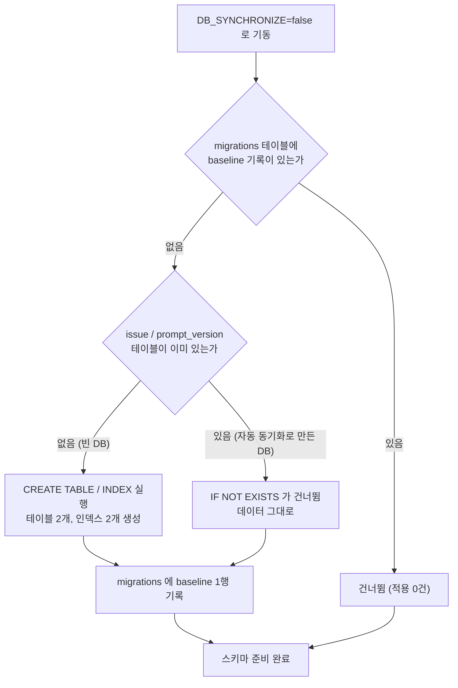
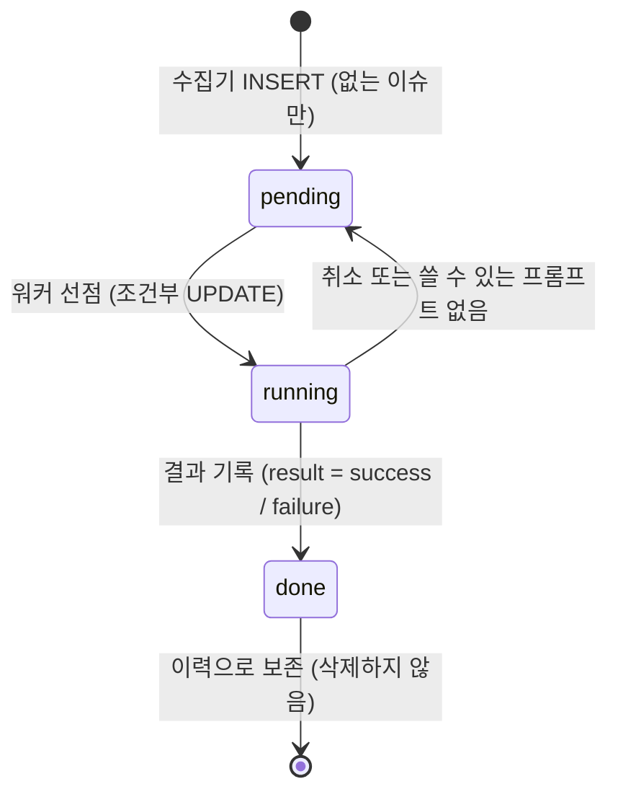
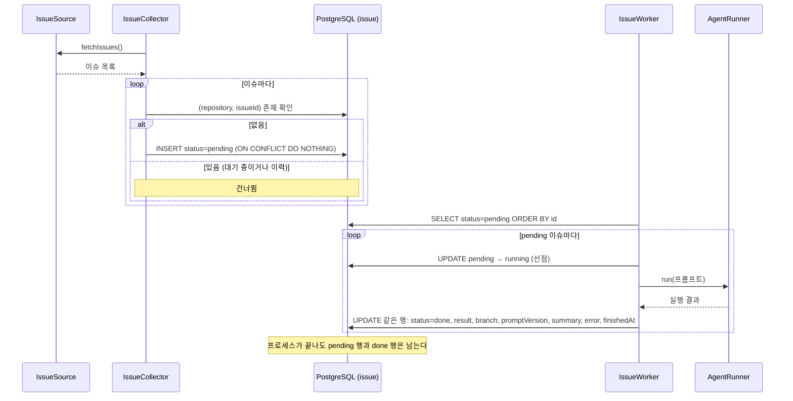

# FLOW CHART — 데이터 저장과 스키마 관리 (DAT-001 ~ DAT-002)

- 작성: 2026-10-02 16:32

## 기동 시 스키마 준비 (DAT-002)

데몬은 Paseo에 연결하기 전에 스키마를 준비한다. `DB_SYNCHRONIZE`가 방식을 고르고, 실패하면 어느 방식이든 종료 코드 1로 끝난다.

## baseline 마이그레이션이 만나는 DB 상태

같은 마이그레이션이 빈 DB와 자동 동기화로 만든 기존 DB 양쪽에서 성공해야 한다.

## 이슈 큐·이력의 상태 (DAT-001, 변경 없음)

`issue` 한 행이 큐 항목에서 처리 이력으로 바뀐다. 행은 지워지지 않으므로 재기동 후에도 큐와 이력이 남는다.

## 변경 이력

| 일시 | Iteration | 변경 내용 | 이유 |
|---|---|---|---|
